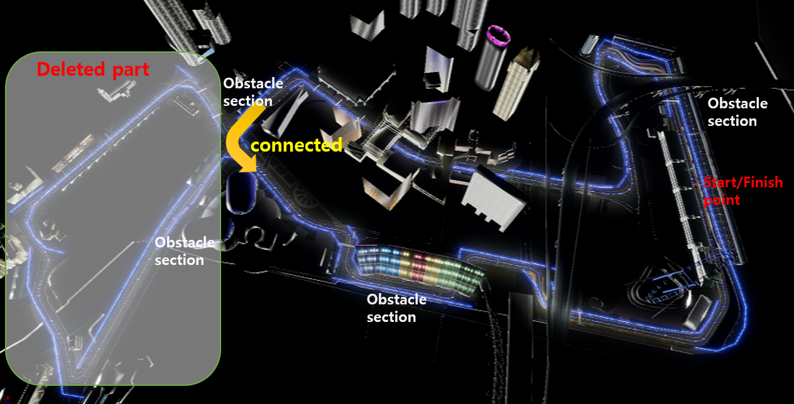
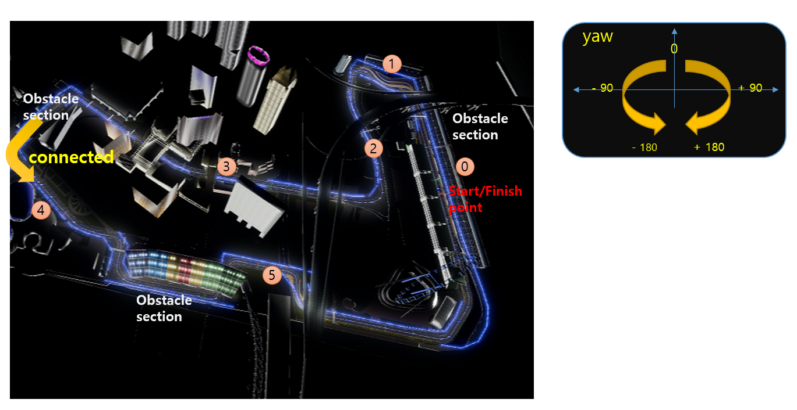

[Korean](./Auto_Guide_Advanced.md) | English | [Home](../README.md)

### ■ Introduction to Marina Bay Circuit 2 (shorten version for the main event)

To reduce the difficulty of the existing circuit, we cut some sections of the track.
The changed parts of the track are as follows.


<br>

### ■ Training the track partially

Because of the size of Marina Bay Circuit,it's hard to train especially later part. To solve this problem, we are guiding you, the internally implemented APIs the setResetLocation () function.

The Api is:

```
    setResetLocation( x coordinate, y coordinate, yaw of vehicle)
```    
            
In the case of the default code, after one episode is executed, Reset () is called to move the vihicle to the starting point. With this guide, you can add a code to move the vehicle to a specific position immediately after a Reset () call.

To do this, you can modify the source dqn_model.py as follows:


```
    def run(self, time_limit_hour):
        ...

        # while 루프시작.
        while not finish:
            ...

            if done:
                ...

                self.client.reset()
                time.sleep(0.2)

                # ======================================================
                # 이 부분 추가
                self.client.setResetLocation(335.96, - 74.21, -51.82)
                check_point_index = 38

                # ======================================================

                ...

                # ======================================================
                # 이 부분 주석 처리
                # check_point_index = 0
                # ======================================================

                scores_per_episode = []
                cur_lab = 1
                half_complete_flag = False
                current_episode += 1

            if round(self.car_current_pos_x, 4) != round(self.car_next_pos_x, 4):
                backed_car_state = car_current_state
            car_prev_state = car_current_state
            car_current_state = car_next_state

            if time_limit_sec != 0 and time.time() - self.start_time > time_limit_sec:
                finish = True
            ##END OF LOOP
```
            
- after the self.client.reset(), call self.client.setResetLocation()
- Assign the proper value to the check_point_index variable and comment out the 'check_point_index = 0' below

For ease of use, we have pre-measured the values ​​of some points.




(1)st  position
```
self.client.setResetLocation(335.96, - 74.21, -51.82)
check_point_index = 38
```
            

(2)nd position
```
self.client.setResetLocation(184.70, - 163.81, 167.95)
check_point_index = 71
```            

(3)rd position
```
self.client.setResetLocation(39.66, - 625.08, - 79.56)
check_point_index = 140
```         

(4) th position
```
self.client.setResetLocation(16.55, - 1073.64, 135.76)
check_point_index = 400
```            

(5) th position
```
self.client.setResetLocation(-217.22,  - 470.09,102.12)
check_point_index = 482
```            

if you want to find a position other than the points that are shown in the picture above, 
In the while loop of dqn_reward_tester.py, add the following statement to print the value to the log. and drive the car with the keyboard to move vehicle to the desired location. That way you can get the x, y coordinates and check point

```
print("current position:", car_current_state.kinematics_estimated.position.x_val, car_current_state.kinematics_estimated.position.y_val, check_point_index)
            
```
The information obtained from the code above is x, y, and check_point_index. 

And, the yaw value of the vehicle is the angle of the front direction of the current vehicle. This value should be adjusted by looking at the direction of the road on the map. The yaw value in the direction of the starting point (the upward direction on the map) is set as zero. and you can check the road shape on the map above and approximate by the angle of the left (-) or right (+). You have to execute the code and make some fine adjustments. 
