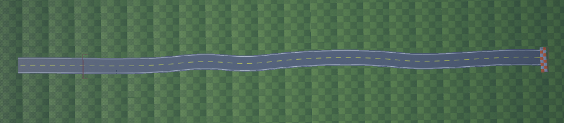
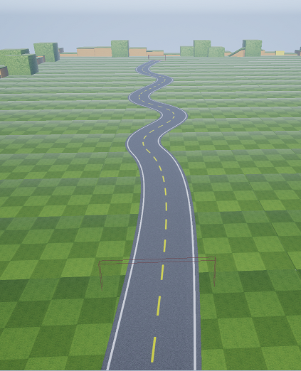
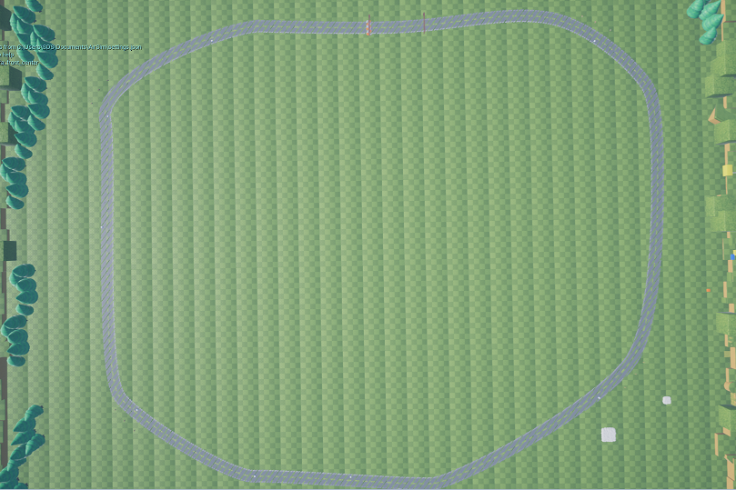

[Korean](./Autonomous_Detail.md) | English  | [Home](../README_Eng.md)

## Autonomous Driving 

### ■ Autonomous driving overview

Autonomous driving uses Reinforcement Learning among several methods of machine learning.

Reinforcement learning is a way for agents to learn by themselves while interacting with the environment. Under certain state, agents are acting by following the defined policy and reaching a new state. Based on the actions taken, agents are rewarded. In this case, the action is an input such as the user moving the joystick up, down, left, or right. Since agents do not know what actions are good actions, we train agents by using rewards function.

In this algorithm competition, the developer does not design the model for learning from the scratch. Instead, the developer creates his own model from the template using the existing model, and only need to modify the hyper-parameter values, the rewards function, and the action space part. Even without prior knowledge of machine learning, you can train the model by defining the action to take, and providing appropriate rewards to encourage specific behaviors. As you review your driving results and enhancing your vehicle to drive better, you can understand how reinforcement learning works in detail.


<br>

### ■ Source code structure

The class structure of the provided source code is as follows. A DQNClient has a DQNAgent. A DQNClient class is used as a template and a few methods are overriden in a concret class, DQNCustomClient.


<br>


dqn_custom_client.py is the file to be editted by developers. 
In this file, training_duration can be set by hour(s) and setting this value as 0 means limitless. 
Model/weight load option is to continue training from the weight values saved previously. Hyper-parameters, action space, reward function will be explained in the next section.


Source codes :

```Python
from dqn_model import DQNClient
from dqn_model import DQNParam
import math
import sys

# =========================================================== #
# Training finish conditions (hour)
# assign training duration by hour : 0(limit less), 1 (an hour), 1.5 (an hour and half) ...
# =========================================================== #
training_duration = 0

# =========================================================== #
# model/weight load option
# =========================================================== #
model_load = False
model_weight_path = "./save_model/.../dqn_weight_00.h5"


# ===========================================================

class DQNCustomClient(DQNClient):
    def __init__(self):
        dqn_param = self.make_dqn_param()
        super().__init__(dqn_param)

    # =========================================================== #
    # Tuning area (Hyper-parameters for model training)
    # =========================================================== #
    def make_dqn_param(self):
        dqn_param = DQNParam()
        dqn_param.discount_factor = 0.99
        dqn_param.learning_rate = 0.00025
        dqn_param.epsilon = 1.0
        dqn_param.epsilon_decay = 0.999
        dqn_param.epsilon_min = 0.01
        dqn_param.batch_size = 100
        dqn_param.train_start = 1000
        dqn_param.memory_size = 20000
        return dqn_param

    # =========================================================== #
    # Action Space (Control Panel)
    # =========================================================== #
    def action_space(self):
        # =========================================================== #
        # Area for writing code
        # =========================================================== #
        # Editing area starts from here
        #
        actions = [
            dict(throttle=0.6, steering=0.1),
            dict(throttle=0.6, steering=-0.1),
            dict(throttle=0.6, steering=0.2),
            dict(throttle=0.6, steering=-0.2),
            dict(throttle=0.6, steering=0)
        ]
        #
        # Editing area ends
        # ==========================================================#
        return actions

    def compute_reward(self, sensing_info):

        # =========================================================== #
        # Area for writing code
        # =========================================================== #
        # Editing area starts from here
        #
        thresh_dist = self.half_road_limit  # 4 wheels off the track
        dist = abs(sensing_info.to_middle)

        if dist > thresh_dist:
            reward = -1
        elif sensing_info.collided:
            reward = -1
        else:
            if dist > 5:
                reward = 0.1
            elif dist > 4:
                reward = 0.2
            elif dist > 3:
                reward = 0.4
            elif dist > 2:
                reward = 0.6
            elif dist > 1:
                reward = 0.8
            else:
                reward = 1

        #
        # Editing area ends
        # ==========================================================#
        return reward


if __name__ == "__main__":
    client = DQNCustomClient()

    if model_load:
        client.agent.load_model(model_weight_path)

    client.run(training_duration)
    sys.exit()
```

<br>        


### ■ DQN Hyper-paramters


Discount_factor : This value usually set between 0 and 1 value. It is used to make a difference between immediate reward and future rewards.


Learning_rate: The amount that the weights are updated during training is referred to as the step size or the 'learning rate'. If this value is too big, it can pass by optimal point and if it is too small, it takes more time to train.


Epsilon : It selects action by Epsilon Greedy policy. Initially, an epsilon value is 1.0 and the agent's action is a complete random exploration. As an epsilon value decays, agent will have bigger probability of making decision based on the trained model.

Epsilon_decay : Epsilon decay rate.

Epsilon_min : The minimum epsilon value. It prevents the epsilon value to become completely decayed to 0, that way there could be random exploration at a minimum level.


Batch_size : A number of data extracted from replay memory at a time.

Train_start: Training starting point. To make random data extraction meaningful, there should be a certain amount of data in replay memory. So it postpone training until enough training data is accumulated.

Memory_size: The collected data while interacting with the environment is consecutive and similar. If an agent use this data immediately, there's am issue. For instance, if an agent fall into the bad situation, the agent train itself to fit in that situation. To minimize this kind of co-relations among training input data, replay memory is used. By sampling from it randomly, the transitions that build up a batch are decorrelated

<br>

### ■ Reward function

In reinforcement learning, designing the reward function plays a very important role in training. Reward refers to the feedback(reward or penalty score) given when the vehicle moves from one place to another on the track. A good move will receive a high score on an action or condition, and a wrong or consuming move will receive low or minus score


The signature of the reward function is:

```Python
                def compute_reward(self, sensing_info):
                    #...
                    #  return proper reward under given conditionals
                    if abs(sensing_info.to_middle) < 5:
                        reward = 1
                    else:
                        reward = -1
                return reward
```


<br>

### ■ Vehicle states used in the reward function

sensing_info is the reward function parameter and it has status information collected from the simulator vehicle. With this information, you can appropriately give a reward for the current status.

<br>

### sensing_info.to_middle

The distance(m) from the center lane of the road to the vehicle. The positive(+) value means the vehicle is on the right side of the land, while the negative value(-) means the vehicle is on the left side of the lane.

Ex) to_middle : -10.73 | Type : float


<br>


### sensing_info.collided

Whether it has collided. If you continue to accelerate in the state of collision with an obstacle, it will continue to be True, and will stop (speed = 0) or go to False if you are out of collision.

Ex) collided : True | Type : bool

<Br>

### sensing_info.speed

Indicates the current vehicle speed(km/h).

Ex) speed : 10.51 | Type : float

<br>

### sensing_info.moving_forward

Indicates whether the vehicle is moving forward(True) or backward(False) to the target point.

Ex) moving_forward : True | Type : bool

<br>

### sensing_info.moving_angle

It is the angle that tells how much it is aligned to the direction of the road. If the value is 0, it indicates that the vehicle is traveling in parallel with the road.

If the value is -30, it means that the vehicle is traveling 30 degree to left(counterclockwise), +30 means that the vehicle is traveling 30 degree to right(clockwise) from the road direction.

Note that +/- is an angle value, not physically right / left side of the road.

Ex) moving_angle : -72.5 | Type : float


<br>


### sensing_info.track_forward_angles

It tells you about the angle of 10 sections ahead of the vehicle as an array based on the current position. One section is 10 meters long thus this array shows angle info up to 100 meters ahead.

If the angle value is +, it indicates the road is tilted to the right from the moving direction based on the current vehicle position. If the angle value is -, it indicates the road ahead is curving to the right, while – value indicates the road ahead is curving to the left.

For example, if below numbers are provided, you can guess that the road is curving to the right, and the degree of curvature can be calculated by the difference between angles.


Ex) track_forward_angles : [4, 8, 12, 16, 20, 27, 43, 52, 55, 58] | Type : list [int]


<br>


### sensing_info.lap_progress

It shows the percentage of progress towards to the finish line. When it becomes 100, you reached the goal and arrived to the finish line.

Ex) lap_progress : 5.43 | Type : float

<br>

### sensing_info.track_forward_obstacles

It shows obstacle information as an array up to 100m ahead.

If there are no obstacles, the array size is 0(empty) and if there are obstacles, they are added to the array in order from the closest one.

The information on the array is the distance between my vehicle and the obstacle from the center line, and the to_middle information of the obstacle.

(- value of the to_middle means the obstacle is on the left side of the road, while + value indicates obstacle is right side of the road)


<br>


The size of the obstacle is fixed length of 2 m in all maps, and it is 1m on the left and right from the to_middle value.


Ex) track_forward_obstacles : [{'dist': 10.72, 'to_middle': 2.93}] | Type : list [dict]

<br>

### About road width

The road width is vary by tracks. To get to know whether the vehicle is on the road or not, use the following variable. This value is half width of the road plus half width of the vehicle. Let's say the road width is 10 m, then this value returns 6.25 which is 5m(half of road) + 1.25m(half of vehicle). (It is declared as a member variable in parent class, so it can be accessed from anywhere)

```Python
                # road half width + car half width
                self.half_road_limit
            
```

<br>


### ■ Examples of reward function

Example 1) Giving a low score (penalty) when colliding or out of the road

```Python
    def compute_reward(self, sensing_info):

        reward = 1
        thresh_dist = self.half_road_limit  # 4 wheels off the track

        dist = abs(sensing_info.to_middle)

        if dist > thresh_dist:
            reward = -1
     elif sensing_info.collided:
            reward = -1

     return reward
```
<br<


Example 2) Driving along the center line


```python

    def compute_reward(self, sensing_info):

        dist = abs(sensing_info.to_middle)
          if dist > 5:
                reward = 0.1
            elif dist > 4:
                reward = 0.2
            elif dist > 3:
                reward = 0.4
            elif dist > 2:
                reward = 0.6
            elif dist > 1:
                reward = 0.8
            else:
                reward = 1

     return reward
```

<br>

### ■ Checking reward function

It is quite not easy to find out whether my reward function really works well, even if you do the training on the simulator with the function you've just made. So you need to check on the road to see if the reward is returning as you intended. The file to do this is dqn_reward_test.py.

If you look at the top of this file, 'enable_api_control' is set to False. That means you can operate vehicle with the keyboard direction key. And there is the compute_reward function part, you can paste your reward fuction here and execute the source code.

The reward value and sensing_info will be printed as logs. While operating the vehicle manually, you can see how the reward value changes on the road. If the log output is too frequent, please adjust the frequency as your preference.

Keep rewrite and test the reward function with this file and once it is done, take it to the dqn client source code.

```Python

# =========================================================== #
# Global Configurations
##
enable_api_control = False  # True(Api Control) /False(Key board control)
is_debug = True
# =========================================================== #

class DQNRewardTester():
    # =========================================================== #
    # Reward function to test
    # =========================================================== #
    def compute_reward(self, sensing_info):

        thresh_dist = self.half_road_limit
        dist = abs(sensing_info.to_middle)

        if dist > thresh_dist:
            reward = -1.0
        elif sensing_info.collided:
            reward = -1.0
        else:
            if dist > 5:
                reward = 0.1
            elif dist > 4:
                reward = 0.2
            elif dist > 3:
                reward = 0.4
            elif dist > 2:
                reward = 0.6
            elif dist > 1:
                reward = 0.8
            else:
                reward = 1

        return reward

    def __init__(self):
            #....

```
<br>


### ■ Action space function

Defines a set of actions that a vehicle can take in response to a status input. In this action space, you define the steering angle, throttle value of the vehicle. As a default, it has 5 actions but you can increase the number of actions. However, please keep in mind that as the number of activities increases, the training time may increase or the level of training may not be achieved.


Hint) Steering angles can range from -1 to 1, but values in the range of -0.5 to 0.5 are usually sufficient for maps that are currently provided. Since the width of the road is not very wide, it is easy to be out of the road when using bigger values. Therefore, it takes longer to converge a model with a faster speed than a model with a slower speed. The throttle value range is between 0 and 1. For the training, it is better to set the throttle value to fixed value. It is recommended that you try training with increasing speed once the Reward function is stabilized to a certain extent.


Action space function example)
```python

     def action_space(self):
        # =========================================================== #
        # Area for writing code
        # =========================================================== #
        # Editing area starts from here
        #
        actions = [
            dict(throttle=0.6, steering=0.1),
            dict(throttle=0.6, steering=-0.1),
            dict(throttle=0.6, steering=0.2),
            dict(throttle=0.6, steering=-0.2),
            dict(throttle=0.6, steering=0)
        ]
        #
        # Editing area ends
        # ==========================================================#
        return actions
```

<br>

### ■ Observing rewards during the training

The total sum of rewards is continually updated and recorded in the airsim_dqn.png file as a graph. The total sum of training rewards is continually updated and recorded in the airsim_dqn.png file, under save_graph folder as a graph

The sum of the rewards is expected to converge to the right upward direction, and this means training is proceeding as desired. If not, it is likely that training will not be useful even after further training.


<br>


<br>


### ■ Saving training weight

The trained weight file will be save as airsim_dqn_00.h5 file in the save_model folder, and this is the file to be submitted on the homepage. The weight file is stored for every 10 episodes. Note that the training weights can only be loaded and used under the same conditions of action space. Remember that if you change the action space after training the model, the saved weight will not work properly because the context does not fit anymore.

<br>

### ■ Evaluating the trained model

If you execute dqn_evaluator.py while running the simulator, the weight file in the specified path (save_model/{time_folder}/airsim_dqn_00.h5) will be loaded from the model so you can test it. Driving will attempt a total of 3 times, showing how many times you have completed the race among these 3 attempts, and the lap time of each attempt. If all 3 attempts fail, the lap time will not be recorded. If you submit it to the homepage, the highest completed record in 3 attempts will be selected.


<br>

### ■ Submit a trained model

If you think that you have done enough training on the model you created, you can submit the learned model from the team menu on the homepage. The detailed description will be guided after the July 1st.


<br>

### ■ Maps

the Step-by-step maps are provided for training


### Tutorial Map (1):

It is almost a straight road. Write simple logic in the Reward function and try to drive along the center line.

 

### Tutorial Map (2):

Step 2 is a more curved road. You might want to train to drive curves with more improved models.





## Basic Round - (1) :

- Difficulty : ★☆☆☆☆

- Road width : 10 m

- Road length : 1,360m

This is a race track with a circular shape. It has both straight and curved roads without any obstacles blocking the road. Please try to train the model in steps 1 and 2 and try full-scale driving on this map. If you run this map successfully, you can submit your model's weight and compare your records with others' records. (After July, 1st)





## Basic Round - (2) :

- Difficulty : ★★☆☆☆

- Road width : 10 m

- Road length: 1,360m

Basic Round 2. This is the same map with the 1st one but with obstacles.

Train your model with obstacles in this map.


<br>


## Speed Racing :

- Difficulty : ★★☆☆☆

- Road width : 16 m

- Road length : 1,860m

This is the circuit map with no obstacles. It has a long straight line, so speed control is essential.

You need to be careful about overturning the vehicle because it is a map that needs to race at a high speed.


