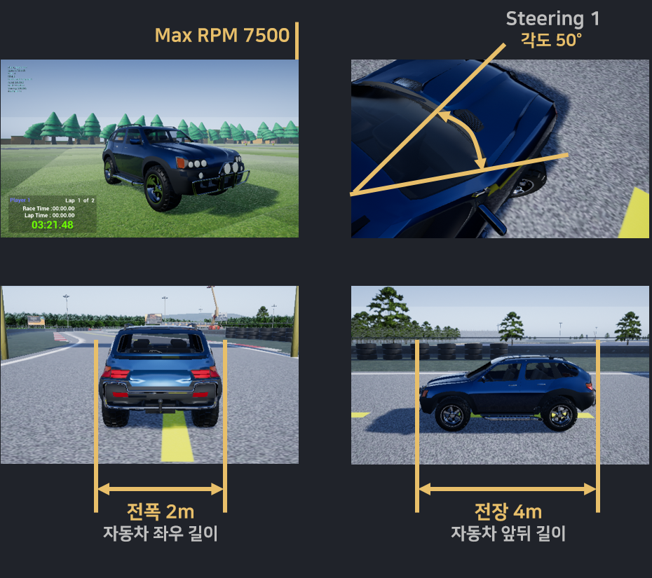
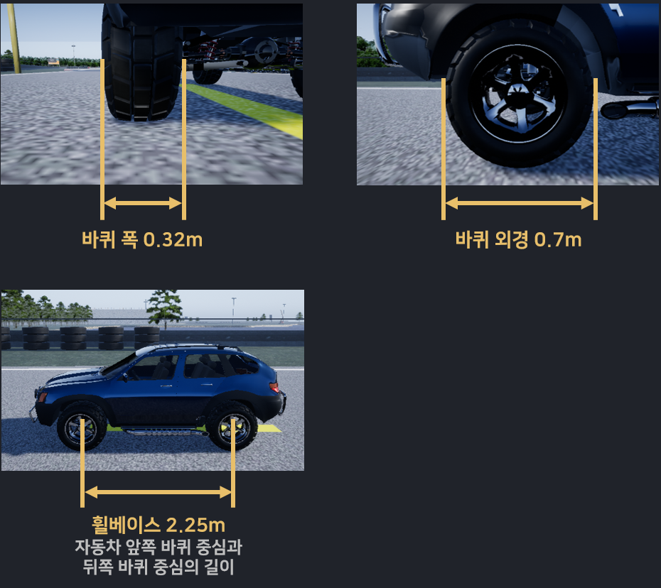
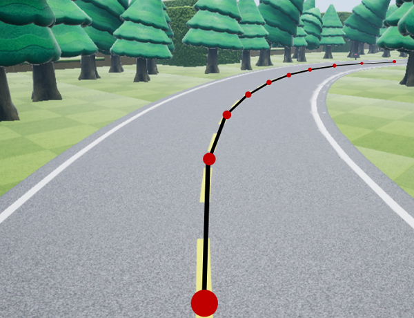
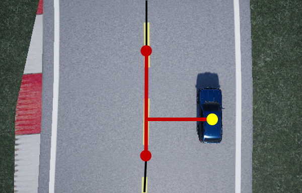

## 기본 정보

### 01. 차량 정보
 

### 02. 도로 정보

모든 도로는 아래 그림과 같이 10m 단위의 way point 구간으로 나눠져 있습니다.

다만, 맨 마지막 way point 구간은 정확하게 10m로 나눠지지 않습니다. 10m 이상일 수도 있고 그 이하일 수도 있습니다. (±5m)

 

제공되는 모든 API는 이러한 way point를 기반으로 계산하고 있습니다.

