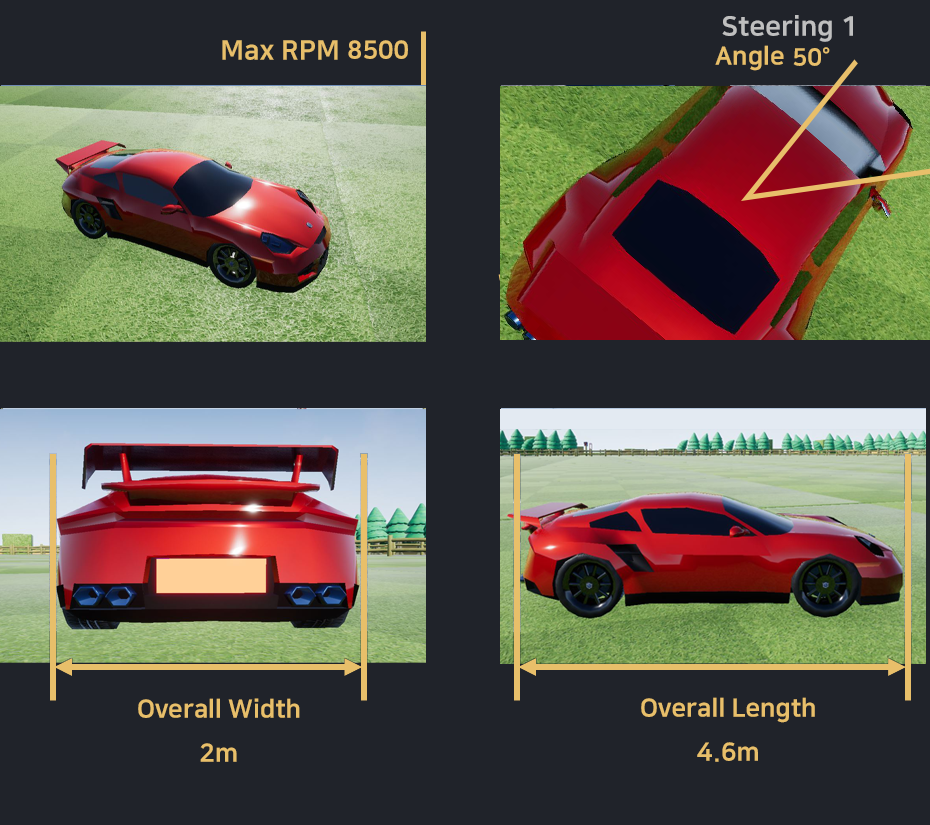
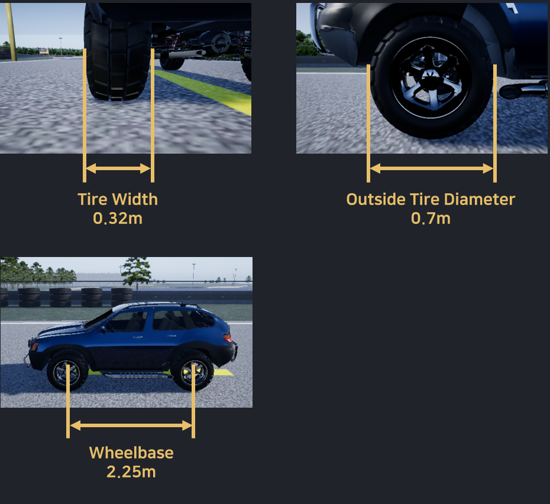

[Korean](./Basic_Info.md) | English  | [Home](../README_Eng.md)

## Basic Information

### 01. Vehicle Information
 

### 02. Circuit information

All circuits are divided into 10m way-points sections as shown below.

However, the last section is not exactly divided into 10m. It may be more than 10m or less. (±5m)

 

All APIs provided are calculated based on these way-points.

