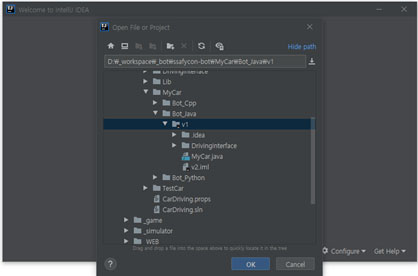
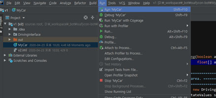
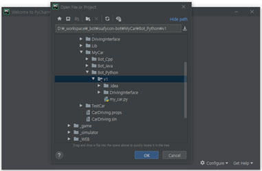
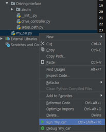
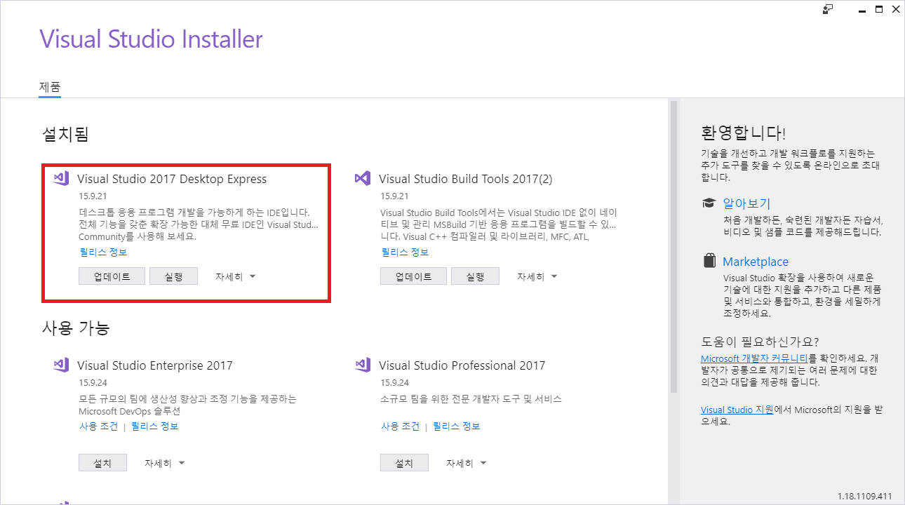
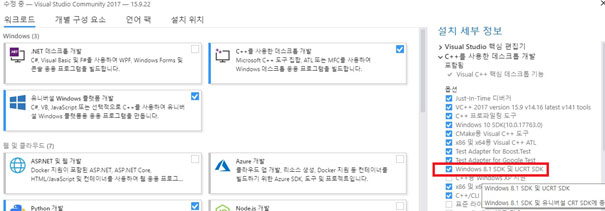
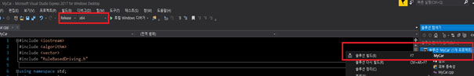
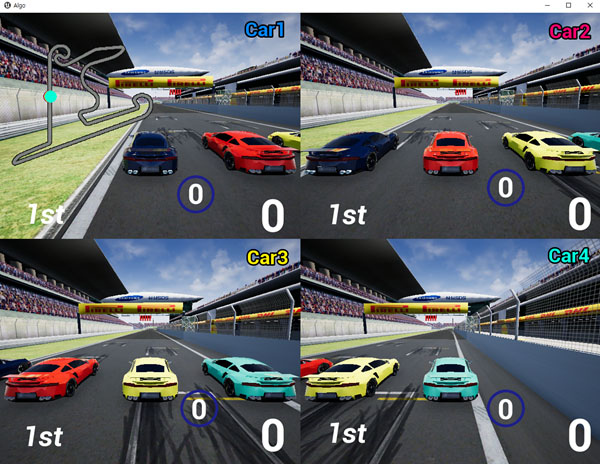
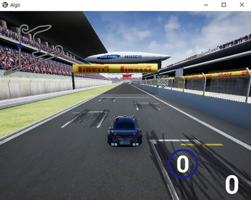

Korean | [English](./Rulebase_Detail_Eng.md)  | [Home](../README_Eng.md)

## 룰기반주행 

## 알고리즘 개발 시작하기


### ■ 사전 조건

윈도우 7, 윈도우 10 64bit에서만 시뮬레이터가 동작합니다.

“문서” 폴더 path 및 윈도우 사용자계정 “영문”만 지원됩니다. 

OneDrive 사용 시, https://github.com/microsoft/AirSim/issues/1066 를 참조해 주세요.


<br>

### ■ 개발 언어 및 에디터

개발 언어는 python, java, cpp로 진행 가능합니다.

기본적인 주행을 위해서는 간단한 if 구문과 변수 값 할당, 사칙연산 정도면 충분합니다.


<br>

### ■ 로컬 개발 환경의 설정 (Simulator)

[Quick start](../QuickStart/Readme.md)  페이지를 참고하시기 바랍니다.


<br>

### ■ (Java) 로컬 개발 환경의 설정

Java 언어로 개발 시에는 jdk(1.8 이상)설치와 java 코드를 개발할 툴을 필요로 합니다. 

jdk의 경우, 1.8 이상의 버전을 필요로 합니다.

현재 주행 bot의 경우, Intellij를 통해 바로 개발 할 수 있도록 프로젝트 파일을 제공하고 있습니다. 

(eclipse를 통해서도 소스 수정 및 실행 가능합니다. 

Eclipse의 경우에도 workspace 설정 후, 

File > Open project from File System 을 통해서 bot_java\v1 폴더를 선택해서 프로젝트를 로딩하면 됩니다.)


<br>

### ■ (Java) 주행 실행 방법

1. Simulator를 실행합니다. (1인 주행 : run.bat, 다인 주행 : runsv.bat)

2. 주행봇을 실행합니다.

다운로드 받은 MyCar의 Bot_java v1폴더에 있는 MyCar.java을 실행하는 것이 필요합니다.

여기서는 IntelliJ 툴을 통해 실행하는 방법을 설명하겠습니다.

다운로드 받은 MyCar의 Bot_java v1폴더를 선택해 오픈합니다.



소스를 (MyCar.java)를 실행합니다. 빌드 진행 후 실행이 됩니다.



소스코드를 보시면 steering 값이 0 인 상태로 천천히 직진하도록 되어있기 때문에, 실행 후 차가 앞으로 전진할 것입니다.

주어지는 센싱 값에 따라 제어를 수행하면서 차가 도로를 이탈하지 않고 주행하도록 하면 됩니다.


<br>

### ■ (Java) 소스코드의 구조

Driving을 제어하기 위한 DrivingInterface 모듈(DrivingInterface.dll)이 내장되어 있으며, DrivingInterface 에서 0.1초 주기로 MyCar Class내의 control_driving 함수를 호출하고 있습니다. (참고로, DrivingInterface.java 파일은 DrivingInterface 모듈에서 전달되는 데이터를 개발자가 쉽게 참조할 수 있도록 가공하여 전달하는 class 입니다.)

실제로 수정이 이루어지는 파일은 MyCar.java이며, 이 파일만 업로드 하여 제출하게 됩니다.

MyCar.java 이외의 수정은 서버에 반영 되지 않습니다.


<br>

### ■ (Java) 당부사항

코드가 작성 가능한 부분은 MyCar.java 내의 멤버 변수 부분, control_driving 메소드 내부 이렇게 제한 되어있습니다.

지정된 곳에만 코드를 추가하여 주시기를 부탁 드립니다. 추가로 아래의 내용에 허용됩니다.

- ‘sensing_info.half_road_limit’ 변수를 사용할 수 있습니다.

- ‘MyCar.java’ 파일에 custom 함수 또는 custom 클래스를 추가할 수 있습니다.

import 구문 추가 시 기본적인 패키지는 서버에도 설치가 되어있겠지만, 특별한 패키지 설치가 필요한 경우 대회 게시판을 통하여 요청 주시기 바랍니다.


<br>


### ■ (Python) 로컬 개발 환경의 설정

Python 언어로 개발 시에는 별도의 IDE가 필요하지는 않습니다. 메모장으로도 가능하나, pycharm을 통해서 바로 개발 할 수 있도록 프로젝트 파일을 제공하고 있습니다.


<br>

### ■ (Python) 주행 실행 방법

1. Simulator를 실행합니다. (1인 주행 : run.bat, 다인 주행 : runsv.bat)

2. 주행봇을 실행합니다.

다운로드 받은 MyCar의 Bot_python v1폴더에 있는 my_car.py을 실행하는 것이 필요합니다.

Python my_car.py을 통해 command 창에서도 실행 가능하고, Pycharm 툴에서도 바로 실행 가능합니다.

여기서는 Pycharm 툴을 통해 실행하는 방법을 설명하겠습니다.

MyCar의 Bot_python v1폴더를 선택해 오픈합니다.



소스(my_car.py) 를 실행합니다.



Command 창에서 “python my_car.py” 를 통해 실행할 수도 있습니다.

소스코드를 보시면 steering 값이 0 인 상태로 천천히 직진하도록 되어있기 때문에, 실행 후 차가 앞으로 전진할 것입니다.

주어지는 센싱 값에 따라 제어를 수행하면서 차가 도로를 이탈하지 않고 주행하도록 하면 됩니다.


<br>

### ■ (Python) 소스코드의 구조

my_car.py 의 DrivingClient 클래스는 drive_control.py 의 DrivingController 클래스를 상속받고 있습니다.

이 중에 실제로 수정이 이루어지는 파일은 my_car.py 이며, 이 파일만 업로드 하여 제출하게 됩니다.

DrivingClass의 생성자에서 while 구문으로 제어루프를 돌리고 있으며, 그 주기는 0.1 초 입니다.

이 값은 로컬에서 테스트 시에 변경이 가능하지만, 서버에서는 my_car.py 파일만 받아서 서버에 존재하는 drive_control.py 와 결합하여 실행됩니다.

따라서 my_car.py 이외의 수정은 서버에 반영 되지 않습니다.


<br>

### ■ (Python) 당부사항

코드가 작성 가능한 부분은 import 구문. 생성자 부분, control_driving 메소드 내부 이렇게 제한 되어있습니다.

지정된 곳에만 코드를 추가하여 주시기를 부탁드립니다. 추가로 아래의 내용에 허용됩니다.

- ‘self.half_road_limit’ 변수를 사용할 수 있습니다.

- ‘my_car.py’ 파일에 custom 함수 또는 custom 클래스를 추가할 수 있습니다.

import 구문 추가 시 기본적인 python 패키지는 서버에도 설치가 되어있겠지만, 특별한 패키지 설치가 필요한 경우 대회 게시판을 통하여 요청 주시기 바랍니다.


<br>

### ■ (C++) 로컬 개발 환경의 설정

C++ 언어로 개발 시에는 windows sdk 8.1설치와 C++ 코드를 개발하고 실행 파일을 만들 툴을 필요로 합니다.

현재 주행 bot의 경우, Visual studio 2017를 통해 바로 개발 할 수 있도록 프로젝트 파일을 제공하고 있습니다.

Windows sdk 8.1을 설치하기 위해서는 아래와 같이 진행하면 됩니다.

Visual studio installer를 실행 후, windows 8.1 sdk를 선택하여 설치 진행합니다.

라이선스가 없는 경우, visual studio express 2017 사용을 권장합니다. (vs_WDExpress.exe) Windows 81.



Windows 81. SDK 및 UCRT SDK 선택 후 수정을 진행합니다. (이미 되어 있다면 생략 가능합니다.)

아니면, 별도의 설치파일로 설치 진행합니다. (sdksetup.exe)



만약 express 버전을 사용하고 있다면, windows 8.1 SDK를 MS 사이트에서 다운로드 후 설치 진행합니다.


<br>

### ■ (C++) 주행 실행 방법

1. Simulator를 실행합니다. (1인 주행 : run.bat, 다인 주행 : runsv.bat)

2. 주행봇을 실행합니다.

다운로드 받은 MyCar의 Bot_cpp v1폴더에 있는 MyCar.vcxproj를 빌드 후 실행하는 것이 필요합니다.

여기서는 Visual studio 2017 툴을 통해 실행하는 방법을 설명하겠습니다.

다운로드 받은 MyCar의 Bot_cpp v1폴더안의 MyCar.vcxproj를 더블클릭 혹은 open project 메뉴를 통해 Visual stuido 2017내에 오픈합니다.

소스를 (MyCar.cpp)를 실행합니다. 빌드 진행 후 실행이 됩니다.

한번 생성된 MyCar.exe(\MyCar\Bot_Cpp\v1\DrivingInterface\Build\Releas\MyCar.exe)를 이용해서 실행할 수도 있습니다.

빌드 configuration은 Release(혹은 debug), x64로 설정 후, 솔루션 파일 선택 후 (혹은 메뉴의 빌드 메뉴를 통해) 솔루션 빌드를 실행합니다. 빌드가 성공적으로 완료되면, 디버그 메뉴의 디버그 하지 않고 시작 (혹은 디버깅 시작) 메뉴를 통해 실행합니다.



소스코드를 보시면 steering 값이 0 인 상태로 천천히 직진하도록 되어있기 때문에, 실행 후 차가 앞으로 전진할 것입니다.

주어지는 센싱 값에 따라 제어를 수행하면서 차가 도로를 이탈하지 않고 주행하도록 하면 됩니다.


<br>

### ■ (C++) 소스코드의 구조

Driving을 제어하기 위한 DrivingInterface 모듈(DrivingInterface.dll)이 내장되어 있으며, DrivingInterface 에서 0.1초 주기로 control_driving 함수를 호출하고 있습니다.

실제로 수정이 이루어지는 파일은 MyCar.cpp이며, 이 파일만 업로드 하여 제출하게 됩니다.

MyCar.cpp 이외의 수정은 서버에 반영 되지 않습니다.


<br>

### ■ (C++) 당부사항

코드가 작성 가능한 부분은 MyCar.cpp내에 변수 구성이 가능하며, control_driving 메서드 내부 이렇게 제한 되어있습니다.

지정된 곳에만 코드를 추가하여 주시기를 부탁드립니다. 추가로 아래의 내용에 허용됩니다.

- ‘sensing_info.half_road_limit’ 변수를 사용할 수 있습니다.

- ‘MyCar.cpp’ 파일에 custom 함수 또는 custom 클래스를 추가할 수 있습니다.


<br>


### ■ 차량의 수집 /제어 정보

control_driving 메서드의 sensing_info 파라미터를 통해 받는 정보는 다음과 같습니다.

<br>

### sensing_info.to_middle

도로의 중앙차선으로부터의 차량까지의 직선 거리(m) 입니다.

이 값이 양의 값(+) 이면 차가 도로의 오른쪽에, 음수값(-) 이면 도로의 왼쪽에 위치함을 의미합니다.

Ex) to_middle : -10.73 | Type : float


<br>

### sensing_info.collided

충돌했는지 여부. 장애물과 충돌상태에서 계속해서 가속을 하면 계속해서 False이며, 정지(속도 = 0) 하거나 충돌상태에서 벗어나면 False 로 바뀝니다.

Ex) collided : True | Type : bool


<br>

### sensing_info.speed

현재 차량의 속도 (km/h) 를 나타냅니다.

Ex) speed : 10.51 | Type : float


<br>

### sensing_info.moving_forward

목표지점을 항하여 정주행(True) 하고 있는지 역주행(False) 하고 있는 나타냅니다.

Ex) moving_forward : True | Type : bool


<br>

### sensing_info.moving_angle

도로의 방향에 얼마나 정렬(align) 되어있는지를 말해주는 각 입니다. 가령, 이 값이 0 인 경우 도로와 평행하게 주행하고 있음을 나타내고,

-30도 이면 정주행 방향에서 왼쪽으로 30도 방향으로 나아가고 있다는 의미이며, +30도 이면 정주행 방향에서 오른쪽으로 30도 방향으로 가고 있다는 의미입니다.

여기서 +/- 는 각도를 의미하는 것이지, 도로 중앙차선의 오른쪽/왼쪽 기준이 아님을 주의하시기 바랍니다.

Ex) moving_angle : -72.5 | Type : float


<br>

### sensing_info.track_forward_angles

현재 위치 기준으로 차량 전방의 10개 구간에 대한 각도를 배열로 알려줍니다. 한개의 구간은 10m 이며, 총 10 개의 정보를 미리 알려주므로 전방의 100 m 까지 정보를 나타내 주는 것이라고 볼 수 있습니다.

각도가 + 일 경우 현재 차량위치에서 정주행 기준으로 오른쪽 방향 으로 기울어지는 각도이며, - 일 경우 왼쪽으로 기울어지는 각도입니다.

예를 들어 이 값이 다음과 같이 들어왔다면, 오른쪽으로 휘어지는 도로가 이어짐을 알 수 있으며, 휘어지는 정도는 각도의 차이를 통하여 판단할 수 있습니다.

Ex) track_forward_angles : [4, 8, 12, 16, 20, 27, 43, 52, 55, 58] | Type : list [int]


<br>

### sensing_info.lap_progress

Goal 지점 대비 얼마나 진행이 되었는지 percentage 로 보여줍니다. 100 이 되면 완주 한 것입니다.

Ex) lap_progress : 5.43 | Type : float


<br>

### sensing_info.track_forward_obstacles

전방 100m 까지의 장애물 정보를 배열로 알려줍니다.


장애물이 없는 경우 배열 사이즈가 0 이며(empty), 장애물이 있으면 가까이 있는 것부터 차례로 배열에 추가 됩니다.

배열에 실려있는 정보는 장애물과의 거리, 그리고 장애물의 to_middle 정보입니다.

(to_middle 값은 도로의 왼쪽에 있으면 - 값, 오른쪽에서 있으면 + 값으로 표시)


<br>

장애물의 사이즈는 모든 맵에서 고정 길이 2 m 이며, to_middle 값 기준으로 좌우 1 m 라고 보시면 됩니다.


Ex) track_forward_obstacles : [{'dist': 10.72, 'to_middle': 2.93}] | Type : list [dict]


<br>

### sensing_info.opponent_cars_info

전방 100m, 후방 100m 안에 있는 상대편 차량의 정보를 알려줍니다.

배열의 순서는 내 차와 가까이 있는 순으로 정렬하여 들어옵니다.


상대편 차량에 대해 주어지는 정보는 아래와 같습니다.

1) 상대 차량의 이름

2) 도로 중앙선 기준으로 내 차와의 거리 차이(전방에 있을 때는 +값, 후방에 있을 때는 -값)

3) 상대방 차량이 현재 도로 중앙에서 얼마나 떨어져서 주행하고 있는지(to_middle 값)

4) 상대편 차량의 속도

<br>

          
내 차량과 상대편 차량의 거리는 각 차의 중앙점을 기준으로 표시됩니다.

가령 상대방과 내 차의 거리가 +10 m 이고, 내 차와의 to_middle(중앙차로에서의 거리) 값이 비슷하다면 
각 차량의 길이를 고려했을 때 바로 내 차의 앞을 주행하고 있는 것이겠죠.          
          
   
상대 차량이 전방에 있는 경우, 거리는 양수값으로 들어옵니다. 
숫자값은 m 단위 입니다.
          
   
상대 차량이 후방에 있는 경우, 거리는 음수값으로 들어옵니다.

   
곡선인 도로인 경우에도, 위의 이미지와 같이 도로 중앙선을 기준으로 거리를 측정하였습니다.
Ex) opponent_cars_info : [{'car_name': 'Car2', 'dist': -0.1, 'to_middle': 2.0, 'speed': -0.0}] | Type : list
<br>

### sensing_info.distance_to_way_points

전방 10개의 way-point 와 차량의 직선 거리를 제공합니다.
 
Ex) distance_to_way_points : [2.98, 12.47, 22.42, 32.39, 42.34, 52.32, 62.26, 72.13, 81.83, 91.22] | Type : list [float64]

   


### About road width

도로의 폭은 맵 별로 조금씩 차이가 납니다. 도로 이탈여부를 판단하기 위하여 도로폭을 사용하실 때에는 다음 변수값을 사용하시기 바랍니다. 이 값은 도로 절반 폭에 차량 절반 폭을 더한 값이며, 만약 도로가 10m 폭의 도로이면, 절반폭인 5 m + 차량절반폭(1.25m) 가 더해진 6.25 의 값을 가지고 있습니다.(부모 클래스에 멤버변수로 값을 담고 있기 때문에 위치에 상관없이 사용하실 수 있습니다.)

```python
                # road half width + car half width
                (Java, cpp) sensing_info.half_road_limit
                (Python) self. half_road_limit
```            

<br>

### ■ 차량제어

### car_controls.steering

steering 값이 + 값이면 오른쪽 방향으로 제어, steering 이 - 값이면 왼쪽 방향으로 제어가 이루어집니다.

값의 범위 : -1 에서 +1 의 값


<br>

### car_controls.throttle (Accelerator)

0 보다 큰 값은 전진을 의미하고, 0 보다 작은 값은 후진을 의미합니다. + 값에서의 기어는 속도에 따른 자동으로 변속이 이루어 집니다.

값의 범위 : -1 에서 +1 의 값


<br>

### car_controls.brake

브레이크는 0 에서 1 사이의 값을 받습니다. throttle 과 별개로 차를 정지하거나 감속할때 사용가능합니다.


<br>

## ■ 멀티플레이 가이드

### Step1. json 파일 생성

최초 시뮬레이터 실행시 하기와 같은 Choose Vehicle 이라는 메시지가 보이고

이때 "예(Y)"를 클릭하면 자동차 모드로 실행이 됩니다.


<br>
추가적으로 하기 경로에 settings.json 이라는 파일이 생성이 됩니다.
(사용자 계정 : SDS의 경우)

경로 : C:\Users\SDS\Documents\AirSim

파일 : settings.json


<br>

### Step2. json 파일 수정하기

■ 멀티플레이

- settings.json 파일을 열어서 기존 내용을 모두 지우고 하기 소스를 넣어줍니다.

- 4대 진행에 대한 예제입니다. (2대 ~ 4대까지 vehicles 부분을 개수 맞추고,, 차량 위치 , X, Y, Z 조정해서 올려주시면 됩니다.)

```json
    {
     "SettingsVersion": 1.2,
     "SimMode": "Car",
     "Algo": {
        "Map": "1"
     },
     "Vehicles": {
        "Car1": {
            "VehicleType": "PhysXCar",
            "X": 0, "Y": -6, "Z": 0
            "Name": "Car1"
         },
        "Car2": {
           "VehicleType": "PhysXCar",
           "X": 0, "Y": -2, "Z": 0
           "Name": "Car2"
         },
        "Car3": {
           "VehicleType": "PhysXCar",
           "X": 0, "Y": 2, "Z": 0
           "Name": "Car3"
         },
        "Car4": {
           "VehicleType": "PhysXCar",
           "X": 0, "Y": 6, "Z": 0
           "Name": "Car4"
         }
      }
    }
```            

<br>

■ 싱글플레이

- 차량 한대로 다시 변경하는 방법은 하기와 같이 작성합니다.

```json
    {
     "SettingsVersion": 1.2,
     "SimMode": "Car",
     "Algo": {
        "Map": "1"
     },
     "Vehicles": {
        "Car1": {
           "VehicleType": "PhysXCar",
           "X": 0, "Y": 0, "Z": 0
        }
     }
    }
```            

<br>

### Step3. 차량 동시 운행

### ■ Client 실행 방법

1. Java

IDE 툴에서 실행하거나

Command 창 실행 후, MyCar.class 파일 위치(\MyCar\bot_java\)에서 “java MyCar” 실행

2. Python

IDE 툴에서 실행하거나

Command 창 실행 후, my_car.py 파일 위치(\MyCar\bot_python\)에서 “python my_car.py” 실행

3. Cpp

IDE 툴에서 실행하거나

Command 창 실행 후, MyCar.exe 파일 위치(\MyCar\bot_cpp\DrivingInterface\Build\Release\) “MyCar.exe” 실행


<br>

### ■ 멀티플레이

1. 4인의 경우, 시뮬레이터 실행 (runsv.bat)

2. 1번 ~ 4번 Client를 순차적으로 실행




<br>

### ■ 싱글플레이

1. 시뮬레이터 실행 (run.bat)

2. 1번 Client 실행




<br>

차량 및 트랙 관련 기본정보 확인은 여기로 
[Basic Information](./Basic_Info.md)
