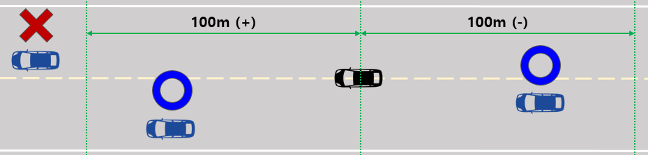
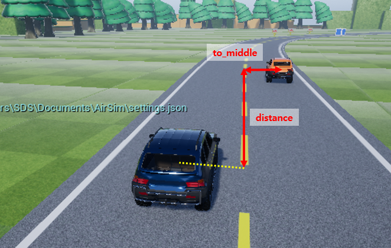
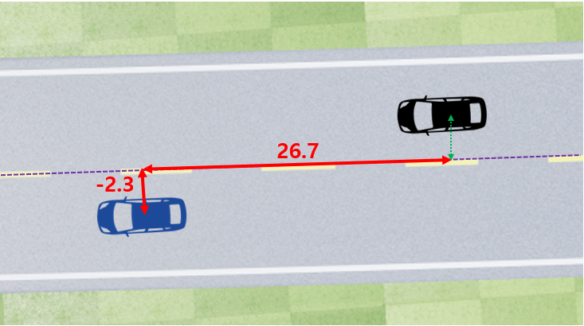
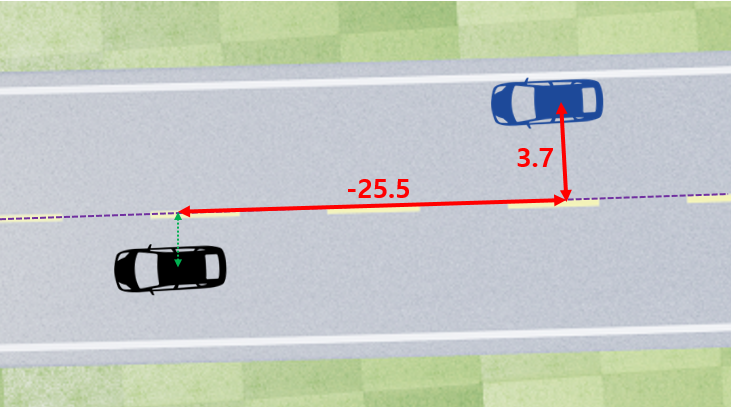
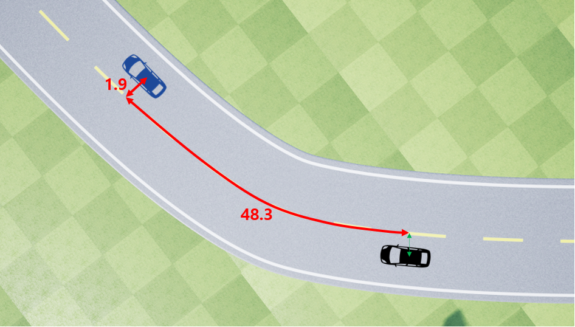
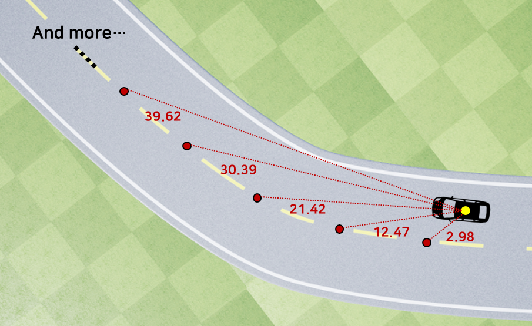

[Korean](./Rulebase_Detail.md) | English  | [Home](../README_Eng.md)

## Rule-based Driving 

## Getting Started - Rule Based Algorithm Development


### ■ Prerequisite

The runtime for Airsim is Microsoft Windows. We have tested on Windows 7, 10. (64bit)


<br>

### ■  Development language and Tools

The language required is Python language. and no specific editor required. You can use simple text editor that is comfortable for you.

Don't mind, if you don't have any python experience at all.

Only 'if statement', 'simple arithmetic operations' are enough to archive the goal!


<br>

### ■ Local development environment settings

Please refer [Quick start page.](../QuickStart/Readme_Eng.md) 


<br>

### ■ How to start

1. Run Algo.exe from simulator folder.

2. Run the python code ( If you unzip source code, two files are included. drive_control.py and driving_client.py)
```bash
python driving_client.py
```

Inside the source code, steering wheel value is set as 0 and throttle is set to 1. So once you executing the code, it will move forward.

Your mission is to keep the vehicle within the lane, by writing the algorithm making decision upon the sensing information given.


<br>

### ■ Structure of the source code


As you can see, DrivingClient class in driving_client.py inherits DrivingController class in drive_control.py

Only driving_client.py is open for you to modify and this single file is the one to be submitted in the website.

In the constructor of DrivingClass, we are running a control loop with a while statement, and its cycle is 0.1 second.

This value can be changed locally at test time, but the server only receives the driving_client.py file and runs it in combination with the drive_control.py on the server.

Therefore, any modifications other than driving_client.py will not be reflected on the server.


<br>

### Note

You can only write code in import syntax, generator part, and inner control_driving method.

Please add the code only in these specified field. In addition, the following are allowed:

- You can use the ‘self.half_road_limit’ variable.

- You can add custom methods or custom classes to the ‘driving_client.py’ file.


The basic Python package will be installed on the server for you to add import syntax. However, if you need to install a special package, please request by official email(algo.contest@samsung.com).


<br>

### ■ Vehicle collection / Control information
```python
def control_driving(self, car_controls, sensing_info):
```

The information collected by sensing_info parameter of the control_driving method is as follows.

<br>

### sensing_info.to_middle

The distance(m) from the center lane of the road to the vehicle.

The positive(+) value means the vehicle is on the right side of the land, while the negative value(-) means the vehicle is on the left side of the lane.

Ex) to_middle : -10.73 | Type : float


<br>

### sensing_info.collided

Whether it has collided. If you continue to accelerate in the state of collision with an obstacle, it will continue to be True, and will stop (speed = 0) or go to False if you are out of collision.

Ex) collided : True | Type : bool


<br>

### sensing_info.speed

Indicates the current vehicle speed(km/h).

Ex) speed : 10.51 | Type : float


<br>

### sensing_info.moving_forward

Indicates whether the vehicle is moving forward(True) or backward(False) to the target point.

Ex) moving_forward : True | Type : bool


<br>

### sensing_info.moving_angle

It is the angle that tells how much it is aligned to the direction of the road. If the value is 0, it indicates that the vehicle is traveling in parallel with the road.

If the value is -30, it means that the vehicle is traveling 30 degree to left(counterclockwise), +30 means that the vehicle is traveling 30 degree to right(clockwise) from the road direction.

Note that +/- is an angle value, not physically right / left side of the road.

Ex) moving_angle : -72.5 | Type : float


<br>

### sensing_info.track_forward_angles


It tells you about the angle of 10 sections ahead of the vehicle as an array based on the current position. One section is 10 meters long thus this array shows angle info up to 100 meters ahead.

If the angle value is +, it indicates the road is tilted to the right from the moving direction based on the current vehicle position. If the angle value is -, it indicates the road ahead is curving to the right, while – value indicates the road ahead is curving to the left.

For example, if below numbers are provided, you can guess that the road is curving to the right, and the degree of curvature can be calculated by the difference between angles.

Ex) track_forward_angles : [4, 8, 12, 16, 20, 27, 43, 52, 55, 58] | Type : list [int]


<br>

### sensing_info.lap_progress

It shows the percentage of progress towards to the finish line. When it becomes 100, you reached the goal and arrived to the finish line.

Ex) lap_progress : 5.43 | Type : float


<br>

### sensing_info.track_forward_obstacles

It shows obstacle information as an array up to 100m ahead.


If there are no obstacles, the array size is 0(empty) and if there are obstacles, they are added to the array in order from the closest one.

The information on the array is the distance between my vehicle and the obstacle from the centerline, and the to_middle information of the obstacle.

(- value of the to_middle means the obstacle is on the left side of the road, while + value indicates obstacle is right side of the road)


<br>

The size of the obstacle is fixed length of 2m in all maps, and it is 1m on the left and right from the to_middle value.


Ex) track_forward_obstacles : [{'dist': 10.72, 'to_middle': 2.93}] | Type : list [dict]


<br>

### sensing_info.opponent_cars_info

It shows the information of the opponent's vehicle within 100 meters ahead and 100 meters behind.

The order of the arrays is in the order in which they are close to my car.




The following information is provided for the opponent vehicle.

1) Name of the opponent vehicle

2) The distance between my vehicle and the opponent vehicle from the centerline(+ value indicates the opponent vehicle is ahead of my vehicle, - value indicates the opponent vehicle is behind of my vehicle)

3) How far away the opponent vehicle is from the center of the road (to_middle value)

4) Speed of the opponent vehicle

<br>



The distance between my vehicle and the opponent's vehicle is indicated by the center point of each car.

For example, if the distance between my vehicle and opponent’s vehicle is +10m and the to_middle value is similar to my vehicle, the opponent’s vehicle is right in front of mine considering the length of the car.



If the opponent vehicle is ahead, the distance is indicated with a positive number. 
The numeric value is in units of meter.


If the opponent vehicle is behind of your car, the distance is indicated with a negative number.
          
        

Even for curved roads, we measured the distance based on the center line of the road as shown in the image above.

Ex) opponent_cars_info : [{'car_name': 'Car2', 'dist': -0.1, 'to_middle': 2.0, 'speed': -0.0}] | Type : list [dict]

<br>

### sensing_info.distance_to_way_points
 

It tells you about the straight-line distance between the vehicle and the next 10 way-points.
 
Ex) distance_to_way_points : [2.98, 12.47, 22.42, 32.39, 42.34, 52.32, 62.26, 72.13, 81.83, 91.22] | Type : list [float64]


   

### About road width

The road width is vary by tracks. To get to know whether the vehicle is on the road or not, use the following variable. This value is half width of the road plus half width of the vehicle. Let's say the road width is 10 m, then this value returns 6.25 which is 5m(half of road) + 1.25m(half of vehicle). (It is declared as a member variable in parent class, so it can be accessed from anywhere)

```python
                # road half width + car half width
                self.half_road_limit
```            

<br>

### ■  Vehicle controls

### car_controls.steering

If steering value is + value, the vehicle is steering to the right direction. If steering value is - value, the vehicle is steering to the left direction.

Value range: -1 to +1


<br>

### car_controls.throttle (Accelerator)

A value greater than 0 means forward, while a value less than 0 means backward. Gears at + values are automatically shifted according to speed.

Value range: -1 to +1


<br>

### car_controls.brake

Brakes take a value between 0 and 1. It can be used to stop or slow the vehicle apart from the throttle.


<br>

## ■ Guidelines for multi-play

### Step1. Generate json file

When you execute the simulator for the first time, you will see the message 'Choose Vehicle'.

If you click "Yes", it will run in vehicle mode.


<br>
In addition, a file named settings.json will be created in the following path.

Path : C:\Users\SDS\Documents\AirSim

File : settings.json


<br>

### Step2. Modifying the json file

■ Multiplay

- Open the settings.json file, delete all existing contents, and add the following code.

```json
    {
     "SettingsVersion": 1.2,
     "SimMode": "Car",
     "Vehicles": {
        "Car1": {
            "VehicleType": "PhysXCar",
            "X": 0, "Y": -2, "Z": 0
         },
        "Car2": {
           "VehicleType": "PhysXCar",
           "X": 0, "Y": 2, "Z": 0
         }
      }
    }
```            

<br>

■  Single play

- Follow below instructions to change to single play mode.

```json
    {
     "SettingsVersion": 1.2,
     "SimMode": "Car"
    }
```            

<br>

### Step3. Modifying Python files

### ■ Multiplay

- It requires two client python files. (copy driving_client.py)
- Modify the player_name at the bottom of each client python file.

```python
        def setting_player_name(self):
            player_name = ""   #Enter the name of the vehicle to be operated
        return player_name
```
            
* The default name of the vehicle is in settings.json Vehicles as Car1 and Car2.(It can be changed.)


<br>

### ■ Single play

- You can leave it blank without any changes.

<br>

### Step4. Simultaneous driving

### ■ Multiplay

1) Run the simulator (Algo.exe)

2) Run Client python #1 (player_name = "Car1")

3) Run Client python #2 (player_name = "Car2")


<br>

### ■ Single play

1) Run the simulator (Algo.exe)

2) Run Client python #1


<br>

### ■ Additional features

Change Camera View

- Hotkey: number 4

- Clicking the hotkey will switch the screen as shown below.

Car1 View


<br>
Car2 View


※ Depending on the changed camera view, the upper left state value is changed to the corresponding vehicle status value.


<br>

### ■ Introduction to Maps

### First Map : Basic Round

- Difficulty : ★★☆☆☆

- Road width : 10m

- Road length : 1,360m

finish two tracks on a map which has straight and gentle curved course with avoidable obstacles

This is a track for creating the basic driving bot for the tutorial stage


<br>

<br>
<br>


### SSecond Map : Speed Racing (1)

- Difficulty : ★★☆☆☆

This is the circuit map with no obstacles. It has a long straight line, so speed control is essential.

You need to be careful about overturning the vehicle because it is a map that needs to race at a high speed.


### Second Map : Speed Racing (2)

- Difficulty : ★★★☆☆

A version with added obstacles to Speed Racing (1)


- Road width : 16m

- Road length : 1,860m


<br>

### Third Map : Smurf Valley Map 

- Difficulty : ★★★☆☆

- Road width : 15m

- Road length : 1,953m

A track with a combination of straight line and curve segments with 6 fast curve zones.

Since the obstacles in the form of a cube are arranged and the road width is not wide.

You have to be careful. An overdrive setting is a disqualification due to vehicle overturning.

Because there are many zones surrounded by trees and cliffs.

One false move, you may not be able to finish the race.

<br>

<br>


Basic Information about Car and Circuit 

[Basic Information](./Basic_Info_En.md)
