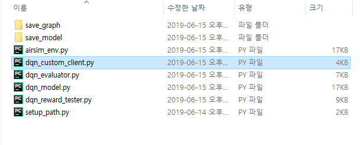

## 자율주행 

### 01. 사전 진행 내용

[시뮬레이터 설치하기](./Readme.md) 에 있는 내용을 먼저 수행하시기 바랍니다.


### 02. pip 로 패키지 인스톨 하기

위 단계를 마치셨다면, 이제 강화학습을 위한 프레임워크 및 모듈을 설치할 순서 입니다.

학습을 위한 환경을 만들기 위하여 Tensorflow 와 Keras 프레임워크를 설치합니다.

명령어 프롬프트(cmd) 혹은 Conda prompt 에서 다음 명령어를 실행합니다.(명령어 프롬프트는 가급적 관리자 권한으로 실행하시기 바랍니다)

프록시 설정은 선택 사항입니다. 개발 환경(사내/사외)에 따라 적절하게 변경하세요.

```
#Tensorflow 설치
> pip install tensorflow --proxy 70.10.15.10:8080 --trusted-host pypi.org
        
#Keras설치
> pip install keras --proxy 70.10.15.10:8080 --trusted-host pypi.org
        
#airsim 모듈 설치
> pip install airsim --proxy 70.10.15.10:8080 --trusted-host pypi.org
```     

※ airsim 설치 도중에 'distributed 1.26.0 has requirement tornado>=5, but you'll have tornado 4.5.3 which is incompatible.' 과 같은 경고가 나타나지만, 실행에는 문제가 없습니다.


### 03. 자율주행 소스코드 실행하기

홈페이지 다운로드 페이지에서 학습을 위한 코드를 다운받습니다.

다운받은 파일의 압축을 풀면 다음과 같이 나타납니다.




시뮬레이터를 실행한 상태에서 dqn_custom_client.py 를 실행하면 자동차가 학습을 시작합니다.
```
> python dqn_custom_client.py
```

dqn_custom_client.py 의 내용은 다음과 같으며, 기본 파라미터 세팅과 행동공간, 보상 함수가 작성되어있습니다. 튜토리얼 맵과 함께 실행하면서, 학습을 시작해보시기 바랍니다 !!

```
from dqn_model import DQNClient
from dqn_model import DQNParam
import math
import sys

# =========================================================== #
# Training finish conditions (hour)
# assign training duration by hour : 0(limit less), 1 (an hour), 1.5 (an hour and half) ...
# =========================================================== #
training_duration = 0

# =========================================================== #
# weight load option
# =========================================================== #
model_load = False
model_weight_path = "./save_model/ ... /dqn_weight_00.h5"


# ===========================================================

class DQNCustomClient(DQNClient):
    def __init__(self):
        dqn_param = self.make_dqn_param()
        super().__init__(dqn_param)

    # =========================================================== #
    # Tuning area (Hyper-parameters for model training)
    # =========================================================== #
    def make_dqn_param(self):
        dqn_param = DQNParam()
        dqn_param.discount_factor = 0.99
        dqn_param.learning_rate = 0.00025
        dqn_param.epsilon = 1.0
        dqn_param.epsilon_decay = 0.999
        dqn_param.epsilon_min = 0.01
        dqn_param.batch_size = 100
        dqn_param.train_start = 1000
        dqn_param.memory_size = 20000
        return dqn_param

    # =========================================================== #
    # Action Space (Control Panel)
    # =========================================================== #
    def action_space(self):
        # =========================================================== #
        # Area for writing code
        # =========================================================== #
        # Editing area starts from here
        #
        actions = [
            dict(throttle=0.7, steering=0.1),
            dict(throttle=0.7, steering=-0.1),
            dict(throttle=0.7, steering=0.2),
            dict(throttle=0.7, steering=-0.2),
            dict(throttle=0.7, steering=0)
        ]
        #
        # Editing area ends
        # ==========================================================#
        return actions

    def compute_reward(self, sensing_info):

        # =========================================================== #
        # Area for writing code
        # =========================================================== #
        # Editing area starts from here
        #
        thresh_dist = 6.5  # 4 wheels off the track
        dist = abs(sensing_info.to_middle)

        if dist > thresh_dist:
            reward = -1
        elif sensing_info.collided:
            reward = -1
        else:
            if dist > 5:
                reward = 0.1
            elif dist > 4:
                reward = 0.2
            elif dist > 3:
                reward = 0.4
            elif dist > 2:
                reward = 0.6
            elif dist > 1:
                reward = 0.8
            else:
                reward = 1

        #
        # Editing area ends
        # ==========================================================#
        return reward


if __name__ == "__main__":
    client = DQNCustomClient()

    if model_load:
        client.agent.load_model(model_weight_path)

    client.run(training_duration)
    sys.exit()

```

더 자세한 내용은 [상세가이드](./autonomous_detail.md)를 참고해 주세요.
