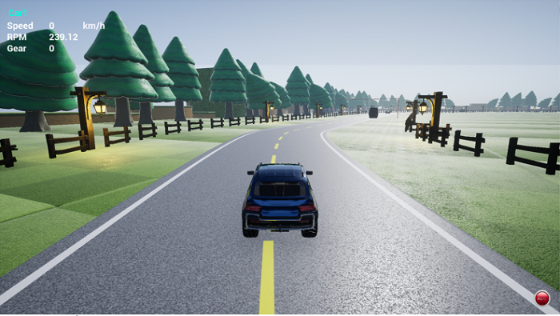
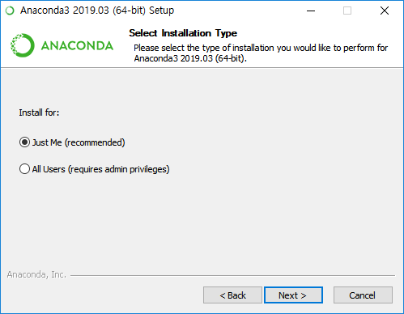
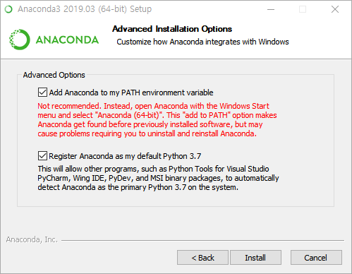

[Korean](./Readme.md) | English  | [Home](../README_Eng.md)

## Get Simulator
### 01. Getting Airsim simulator ready.
--------------------------------

Please, download the Airsim simulator you want to play. A simulator file has only one map file. You should choose which one to download depending up on the map you want to.

※ [Download link](https://drive.google.com/drive/folders/1fkf2ihHAxDxyMN9ABvPnUzwMGZhUcGJm)


The runtime for Airsim is Microsoft Windows. We have tested on Windows 7, 10 (64 bit)

Once you download a zipfile and unzip, they will look like below. You can execute Algo.exe to run Airsim simulator.


<br>
	  
If you don't want to run as a full screen for your convenience or performance issue, you can execute run.bat which will run the simulator on a popup window. Its resolution is set 640x480 as a default but you can customize it on your convenience by editing run.bat.

The very first time you executing the Algo.exe file, it will request you to install UE4 Prerequisites. Once it is done, simulator will automatically come up.


<br>

And please select 'Yes' to the following dialogue. (If 'No', then a drone mode will be activated)


<br>
	  
Vehicle simulator is now running like a screen.


<br>

Simulator Help

- Press F1 for help.


<br>
	  
Modifying settings.json

- modify as follows.

Path : C:\Users\SDS\Documents\AirSim

File : settings.json

```

    {
	 "SettingsVersion": 1.2,
	 "SimMode" : "Car",
	 "ClockSpeed": 1
    }
```	

The above is the default setting.

※ About clock speed of Airsim simulator

By modifying settings.json file in the path : C:\Users\{username}\Documents\AirSim, you can change the speed of Airsim simulator. The Airsim official document said by increasing clock speed may deteriorates simulator quality, such as physical law distortion. Therefore, when code/model is submitted, the server will run the code/model with x1 speed. When testing locally, we recommend that you run the test within 2x and for the final submission, please verify in the x1 speed environment


※ Modifying to x2 speed environment

- Edit setting.json -> "ClockSpeed": 2
- Rule based driving : At the top of drive_controller.py file, modify 'current_clock_speed = 2'
- Autonomous driving : At the top of dqn_model.py file, modify 'current_clock_speed = 2'


### 02. Installing Anaconda

A. Please, retrieve the latest version(3.7) of Anaconda fro the URL below.

MacOS is selected by default, so choose the Windows menu.


<br>

https://www.anaconda.com/distribution/#download-section


B. Run the installation file and move on step by step by clicking the next button.

There are two Installation types. 'Just me' is chosen for now.

'All Users' option is also OK. But it requires admin privileges whenever you install packages or modifying configuration of Anaconda.

To give admin privilege, find the program you want to run - in this case command prompt(cmd) - right click and select 'Run as administrator'.



<br>

C. Select advanced installation options




a) Adding Anaconda to my PATH environment variable (default is unchecked)

This option will add Anaconda path to the environment variables. If you have previously installed python runtime, you can uncheck this option. And if you are installing Anaconda for the first time in your PC, you can check and proceed. This will allow for you to execute python at any directory location. Id don't want to think about these, you can just uncheck it and use Anaconda prompt instead of cmd prompt.


b) Register Anaconda as my default Python 3.7

this option will set Anaconda as a default Python runtime. If you don't have it previously, check and continue to install.

After you select all the choices, the complete installation process will take some times. Please be patient.

Once installation is done, run cmd command or Anaconda prompt from start menu and check python version by typing this command.


If you see current version information like this, it is considered the installation is properly done.
```
C:\Users\SDS>python --version
  Python 3.7.3 :: Anaconda, Inc.
```

### 03. Installing airsim module

Run command below on cmd or Anaconda prompt (with administrator privilege)

(Anaconda prompt is recommended if the pip install fails in the command window.)

Proxy settings are optional. Make the appropriate changes according to your environment.

```
C:\Users\SDS>pip install airsim --proxy 프록시주소:포트 --trusted-host pypi.org
```

※ while airsim package installation, you can encounter a warning message but it doesn't affect the function that we are going to use.

#distributed 1.26.0 has requirement tornado>=5, but you'll have tornado 4.5.3 which is incompatible.

<br>

We are almost ready.
<br>
Go to Rule-based Driving or Autonomous Driving to continue.
Go to [Rule-based Driving](./Rulebase_Start_Eng.md) to continue.


MSR Aerial Information and Robotics Platform/Simulator (AirSim), Copyright (c) Microsoft Coporation.
2019 Algorithm Contest uses the Unreal® Engine.  Unreal® is a trademark or registered trademark of Epic Games, Inc. in the United States of America and elsewhere. 
Unreal® Engine, Copyright 1998 – 2019, Epic Games, Inc.  All rights reserved.
