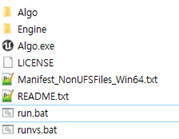
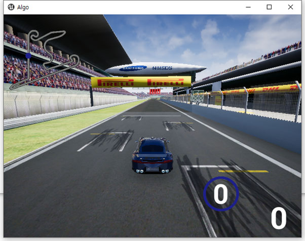
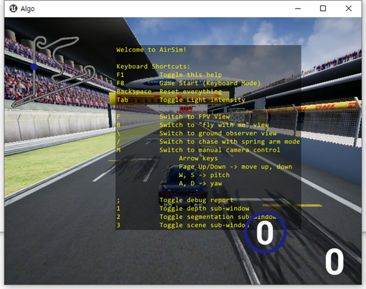
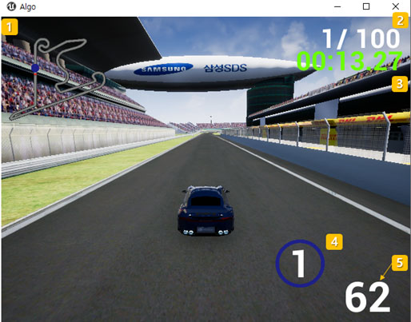

[Korean](./Readme.md) | English  | [Home](../README_Eng.md)

## Installing a Simulator
### 01. Prepare the simulator
--------------------------------

Download the simulator. The simulator contains a track, and the simulator file is distributed for each track.

※ [Related file download link(China)](https://drive.google.com/file/d/1cY6y6Us9B1bSmgegO324Tat6zwNFhJpO/view?usp=sharing)
※ [Related file download link(Austria)](https://drive.google.com/file/d/1L_txZlh4FhV20ufh4nizvl91ti_NLMFs/view?usp=sharing)
※ [Related file download link(Bahrain)](https://drive.google.com/file/d/1GkWtOkf1RNui_o2oy4ZY-tBpy7JZxqWg/view?usp=sharing)


The simulator execution environment is MS Windows 7 / MS Windows 10. (64 bit)

If you unzip the downloaded file, it will be as follows. You can run the run.bat here.


<br>

If you want to display it on a small screen rather than a full screen due to convenience or PC performance problems, run the run.bat. You can specify the horizontal vertical size of the screen in the run.bat file, and in the attached file, -ResX=640 -ResY=480.

When running the Algo.exe file for the first time, it requires UE4 installation. After UE4 prerequisite installation completion, simulator is executed.


<br>

When running, please select Yes in the following dialog. (If you do No, the drone appears instead of the car )


<br>
	  
This is the first screen on which the simulator was executed.


<br>

You can exit or maximize the simulator through window window default actions such as Close, Maximize, etc.

During the Simulator iteration, when an abnormal operation occurs, go to the task manager, force exit algo-win64-Shipping.exe, and then run restart.


Simulator Help

- Press F1 for help.


<br>

Features are provided through shortcuts.

1. F8: Starts in adjustable manual mode via keyboard.

2. Backspace: Initialize simulator. After you try driving, when you want to try again, use it.

3. Manually adjust camera: See Help for details

4. camera view adjustment

- F : FPV view, B : “fly with me” view, \ : ground observer view, / : chase with spring arm view

This is the driving screen of the simulator.



1. Indicates the location on the track as a mini-map.

2. Current Lap / Total Lap count

3. travel time

4. gear

5. Speed (km / h)

After completing the driving, or if you want to stop and proceed again, proceed after initialization through the "backspace" key.


<br>

### 02. Modify Settings File

Modify settings.json

Path : C:\Users\{user}, ex. SDS }\Documents\AirSim

File : settings.json 

```

    {
	 "SettingsVersion": 1.2,
	 "SimMode" : "Car"
    }
```	

The above is the most basic type of setting.

The following are the contents that can be set.

After modifying settings.json, you must re-run simulator.

In the case of "Map", the type of obstacle configuration is shown.

The “ Map ” may have one of “ 1 ”, “ 2 ” or “ 3 ”.

If not defined, one of 1 to 3 obstacles is set arbitrarily.

```
    {
	 "SettingsVersion": 1.2,
	 "SimMode" : "Car",
	 "Algo": {
	 	"Map": "1"
	 },
	 "Vehicles": {
	 	"Car1": {
			"VehicleType": "PhysXCar",
			"X": 0, "Y": 0, "Z": 0
		}
	 }
    }
```	


<br>

### 03. Try driving using keyboard mode

Using Keyboard Mode

After executing the simulator, enter the "F8" key (car can be operated with the direction key )

※ After executing Client Python, the "F8" key can not be entered. After initializing the simulator with the "backspace" key, it can be re-entered.

We're almost ready.

Through the detailed guide of the bulletin board, please create a source code and perform the driving.

<br>
