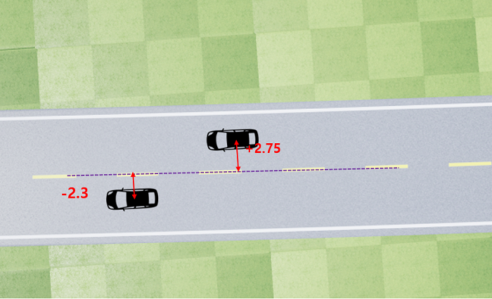
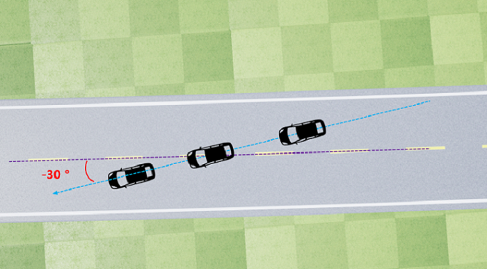
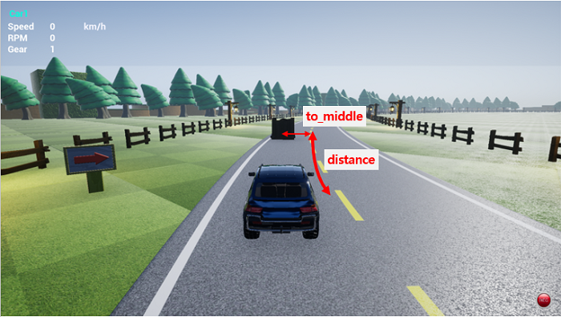
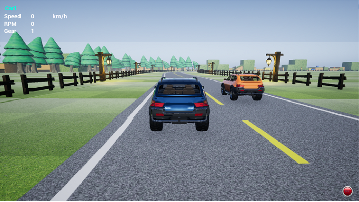
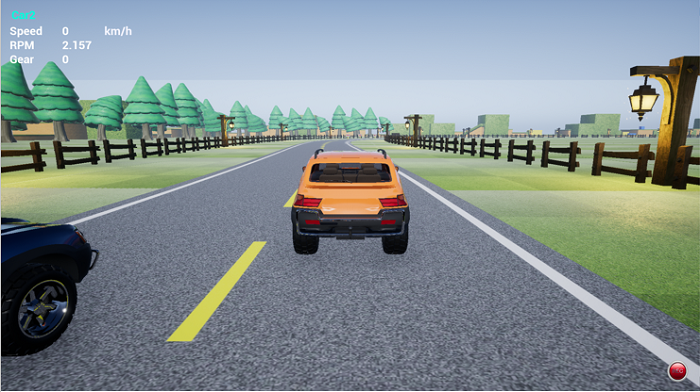
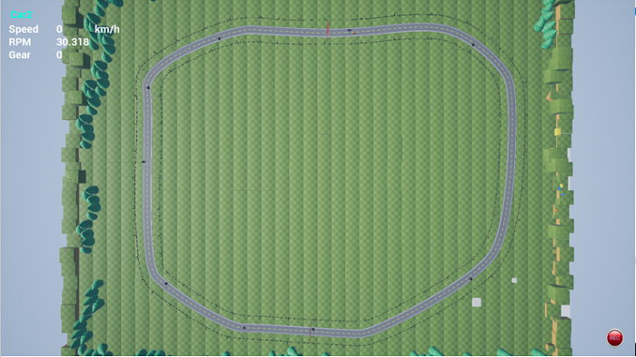
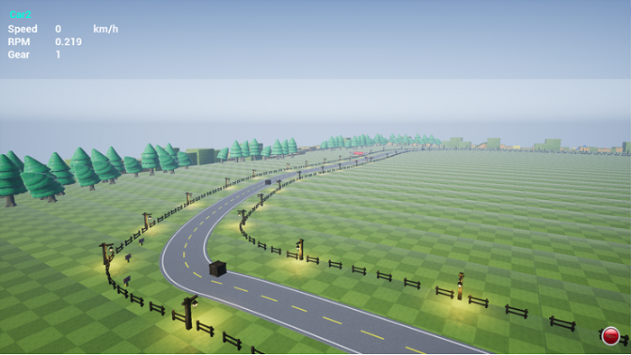
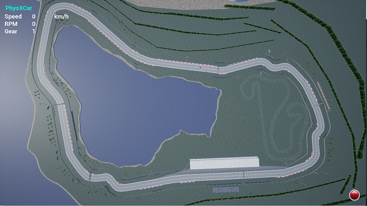
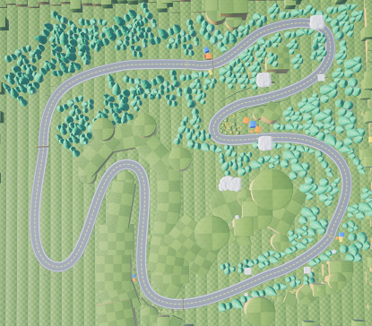

## 룰기반주행 

## 알고리즘 개발 시작하기


### ■ 사전 조건

윈도우 7, 윈도우 10 에서만 시뮬레이터가 동작합니다. (64bit)


<br>

### ■ 개발 언어 및 에디터

개발 언어는 python 입니다. 그리고 특별한 에디터가 필요하지 않습니다. python 코드를 수정할 수 있는 단순 텍스트 에디터라면 무엇이든 가능합니다.

기존에 파이썬 언어를 사용해신 경험이 없으셔도 두려워 하지 마세요 !!

어차피 간단한 if 구문과 변수 값 할당, 사칙연산 정도면 충분합니다.


<br>

### ■ 로컬 개발 환경의 세팅

[Quick start](./Readme.md) 페이지를 참고하시기 바랍니다.


<br>

### ■ 프로그램 실행 방법

1. Algo.exe 실행합니다.

2. 소스 실행 (다운받은 소스는 drive_control.py 과 driving_client.py 이렇게 2개의 파일입니다.)
```bash
python driving_client.py
```

소스코드를 보시면 steering 값이 0 인 상태로 천천히 직진하도록 되어있기 때문에, 실행후 차가 앞으로 전진할 것입니다.

주어지는 센싱 값에 따라 제어를 수행하면서 차가 도로를 이탈하지 않고 주행하도록 하면 됩니다.

<br>

### ■ 소스코드의 구조


driving_client.py 의 DrivingClient 클래스는 drive_control.py 의 DrivingController 클래스를 상속받고 있습니다.

이 중에 실제로 수정이 이루어지는 파일은 driving_client.py 이며, 이 파일만 업로드하여 제출하게 됩니다.

DrivingClass 의 생성자에서 while 구문으로 제어루프를 돌리고 있으며, 그 주기는 0.1 초 입니다.

이 값은 로컬에서 테스트 시에 변경이 가능하지만, 서버에서는 driving_client.py 파일만 받아서 서버에 존재하는 drive_control.py 와 결합하여 실행됩니다.

따라서 driving_client.py 이외의 수정은 서버에 반영 되지 않습니다.


<br>

### 당부사항

코드가 작성 가능한 부분은 import 구문. 생성자 부분, control_driving 메서드 내부 이렇게 제한 되어있습니다.
지정된 란에만 코드를 추가하여 주시기를 부탁드립니다.

import 구문 추가시 기본적인 파이썬 패키지는 서버에도 설치가 되어있을 것이지만, 특별한 패키지가 설치 필요한 경우 대회 홈페이지 게시판을 통하여 요청주시기 바랍니다.

<br>

### ■ 차량의 수집 /제어 정보
```python
def control_driving(self, car_controls, sensing_info):
```

control_driving 메서드의 sensing_info 파라미터를 통해 받는 정보는 다음과 같습니다.

<br>

### sensing_info.to_middle

도로의 중앙차선으로부터의 차량까지의 직선 거리(m) 입니다.

이 값이 양의 값(+) 이면 차가 도로의 오른쪽에, 음수값(-) 이면 도로의 왼쪽에 위치함을 의미합니다.

Ex) to_middle : -10.73 | Type : float




<br>

### sensing_info.collided

충돌했는지 여부. 장애물과 충돌상태에서 계속해서 가속을 하면 계속해서 False이며, 정지(속도 = 0) 하거나 충돌상태에서 벗어나면 False 로 바뀝니다.

Ex) collided : True | Type : bool


<br>

### sensing_info.speed

현재 차량의 속도 (km/h) 를 나타냅니다.

Ex) speed : 10.51 | Type : float


<br>

### sensing_info.moving_forward

목표지점을 항하여 정주행(True) 하고 있는지 역주행(False) 하고 있는 나타냅니다.

Ex) moving_forward : True | Type : bool


<br>

### sensing_info.moving_angle

도로의 방향에 얼마나 정렬(align) 되어있는지를 말해주는 각 입니다. 가령, 이 값이 0 인 경우 도로와 평행하게 주행하고 있음을 나타내고,

-30도 이면 정주행 방향에서 왼쪽으로 30도 방향으로 나아가고 있다는 의미이며, +30도 이면 정주행 방향에서 오른쪽으로 30도 방향으로 가고 있다는 의미입니다.

여기서 +/- 는 각도를 의미하는 것이지, 도로 중앙차선의 오른쪽/왼쪽 기준이 아님을 주의하시기 바랍니다.

Ex) moving_angle : -72.5 | Type : float





<br>

### sensing_info.track_forward_angles

현재 위치 기준으로 차량 전방의 10개 구간에 대한 각도를 배열로 알려줍니다. 한개의 구간은 10m 이며, 총 10 개의 정보를 미리 알려주므로 전방의 100 m 까지 정보를 나타내 주는 것이라고 볼 수 있습니다.

각도가 + 일 경우 현재 차량위치에서 정주행 기준으로 오른쪽 방향 으로 기울어지는 각도이며, - 일 경우 왼쪽으로 기울어지는 각도이다.

예를 들어 이 값이 다음과 같이 들어왔다면, 오른쪽으로 휘어지는 도로가 이어짐을 알 수 있으며, 휘어지는 정도는 각도의 차이를 통하여 판단할 수 있습니다.

Ex) track_forward_angles : [4, 8, 12, 16, 20, 27, 43, 52, 55, 58] | Type : list [int]


<br>

### sensing_info.lap_progress

Goal 지점 대비 얼마나 진행이 되었는지 percentage 로 보여줍니다. 100 이 되면 완주 한 것입니다.

Ex) lap_progress : 5.43 | Type : float


<br>

### sensing_info.track_forward_obstacles

전방 100m 까지의 장애물 정보를 배열로 알려줍니다.

장애물이 없는 경우 배열 사이즈가 0 이며(empty), 장애물이 있으면 가까이 있는 것부터 차례로 배열에 추가 됩니다.

배열에 실려있는 정보는 장애물과의 거리, 그리고 장애물의 to_middle 정보입니다.

(to_middle 값은 도로의 왼쪽에 있으면 - 값, 오른쪽에서 있으면 + 값으로 표시)



<br>

장애물의 사이즈는 모든 맵에서 고정 길이 2 m 이며, to_middle 값 기준으로 좌우 1 m 라고 보시면 됩니다.


Ex) track_forward_obstacles : [{'dist': 10.72, 'to_middle': 2.93}] | Type : list [dict]


<br>

### sensing_info.opponent_cars_info

전방 100m, 후방 100m 안에 있는 상대편 차량의 정보를 알려줍니다.

배열의 순서는 내 차와 가까이 있는 순으로 정렬하여 들어옵니다.

상대편 차량에 대해 주어지는 정보는 아래와 같습니다.

1) 상대 차량의 이름

2) 도로 중앙선 기준으로 내 차와의 거리 차이(전방에 있을 때는 +값, 후방에 있을 때는 -값)

3) 상대방 차량이 현재 도로 중앙에서 얼마나 떨어져서 주행하고 있는지(to_middle 값)

4) 상대편 차량의 속도

<br>

### sensing_info.opponent_cars_info
내 차량과 상대편 차량의 거리는 각 차의 중앙점을 기준으로 표시됩니다.

가령 상대방과 내 차의 거리가 +10 m 이고, 내 차와의 to_middle(중앙차로에서의 거리) 값이 비슷하다면 각 차량의 길이를 고려했을 때 바로 내 차의 앞을 주행하고 있는 것이겠죠.

상대 차량이 전방에 있는 경우, 거리는 양수값으로 들어옵니다. 숫자값은 m 단위 입니다. 상대 차량이 후방에 있는 경우, 거리는 음수값으로 들어옵니다.

곡선인 도로인 경우에도, 위의 이미지와 같이 도로 중앙선을 기준으로 거리를 측정하였습니다.

Ex) opponent_cars_info : [{'car_name': 'Car2', 'dist': -0.1, 'to_middle': 2.0, 'speed': -0.0}] | Type : list [dict]


<br>

### About road width

도로의 폭은 맵 별로 조금씩 차이가 납니다. 도로 이탈여부를 판단하기 위하여 도로폭을 사용하실 때에는 다음 변수값을 사용하시기 바랍니다. 이 값은 도로 절반 폭에 차량 절반 폭을 더한 값이며, 만약 도로가 10m 폭의 도로이면, 절반폭인 5 m + 차량절반폭(1.25m) 가 더해진 6.25 의 값을 가지고 있습니다.(부모 클래스에 멤버변수로 값을 담고 있기 때문에 위치에 상관없이 사용하실 수 있습니다.)

```python
                # road half width + car half width
                self.half_road_limit
```            

<br>

### ■ 차량제어

### car_controls.steering

steering 값이 + 값이면 오른쪽 방향으로 제어, steering 이 - 값이면 왼쪽 방향으로 제어가 이루어집니다.

값의 범위 : -1 에서 +1 의 값


<br>

### car_controls.throttle (Accelerator)

0 보다 큰 값은 전진을 의미하고, 0 보다 작은 값은 후진을 의미합니다. + 값에서의 기어는 속도에 따른 자동으로 변속이 이루어 집니다.

값의 범위 : -1 에서 +1 의 값


<br>

### car_controls.brake

브레이크는 0 에서 1 사이의 값을 받습니다. throttle 과 별개로 차를 정지하거나 감속할때 사용가능합니다.


<br>

## ■ 멀티플레이 가이드

### Step1. json 파일 생성

최초 시뮬레이터 실행시 하기와 같은 Choose Vehicle 이라는 메시지가 보이고

이때 "예(Y)"를 클릭하면 자동차 모드로 실행이 됩니다.


<br>
추가적으로 하기 경로에 settings.json 이라는 파일이 생성이 됩니다.

경로 : C:\Users\SDS\Documents\AirSim

파일 : settings.json


<br>

### Step2. json 파일 수정하기

■ 멀티플레이

- settings.json 파일을 열어서 기존 내용을 모두 지우고 하기 소스를 넣어줍니다.

```json
    {
     "SettingsVersion": 1.2,
     "SimMode": "Car",
     "Vehicles": {
        "Car1": {
            "VehicleType": "PhysXCar",
            "X": 0, "Y": -2, "Z": 0
         },
        "Car2": {
           "VehicleType": "PhysXCar",
           "X": 0, "Y": 2, "Z": 0
         }
      }
    }
```            

<br>

■ 싱글플레이

- 차량 한대로 다시 변경하는 방법은 하기와 같이 작성합니다.

```json
    {
     "SettingsVersion": 1.2,
     "SimMode": "Car"
    }
```            

<br>

### Step3. Python 파일 수정하기

### ■ 멀티플레이

- client python 파일이 2개 필요합니다. (driving_client.py 복사)
- 각각의 client python 파일 하단에 있는 player_name을 수정합니다.

```python
        def setting_player_name(self):
            player_name = ""   #조작할 차량의 이름을 기입
        return player_name
```
            
＊차량의 이름은 settings.json Vehicles 내 Car1, Car2 입니다. (변경 가능합니다.)


<br>

### ■ 싱글플레이

- 변경 없이 공백으로 두고 실행하면 됩니다.

<br>

### Step4. 차량 동시 운행

### ■ 멀티플레이

1) 시뮬레이터 실행 (Algo.exe)

2) 1번 Client python 실행 (player_name = "Car1")

3) 2번 Client python 실행 (player_name = "Car2")


<br>

### ■ 싱글플레이

1) 시뮬레이터 실행 (Algo.exe)

2) 1번 Client python 실행


<br>

### ■ 추가 기능

카메라 위치 변경

- 단축키 : 숫자 4

- 단축키 클릭시 하기와 같이 화면이 스위칭 됩니다.

Car1 View



<br>
Car2 View



※ 변경된 카메라 View에 따라서 좌측 상단의 state 값이 해당 차량의 상태값으로 변경되어 보여집니다.


<br>

### ■ 맵 소개

### First Map : Basic Round

- 난이도 (Difficulty) : ★★☆☆☆

- 도로폭 (Road width) : 10m

- 도로 길이 (Road length) : 1,360m

직선 코스와 완만한 커브로 이루어진 맵으로 트랙 위의 장애물을 피해 2바퀴를 돌면 완주!

튜토리얼 단계의 기본적인 주행 봇을 만들어 보기 위한 트랙입니다.


<br>

<br>
<br>


### Second Map : Speed Racing

- 난이도 (Difficulty) : ★★☆☆☆

- 도로폭 (Road width) : 16m

- 도로 길이 (Road length) : 1,860m

장애물이 없는 서킷 맵으로 긴 직선주로가 있어 속도 제어가 필수적입니다.

빠른 속도로 주행이 필요한 맵인만큼 차량 전복에 주의가 필요합니다.



<br>

### Third Map : Smurf Valley Map (추후 공개)

- 난이도 (Difficulty) : ★★★☆☆

- 도로 폭 (Road width) : 15m

- 도로 길이 (Road length) : 1,953m

6개의 급커브 구간이 있는 직선주로와 커브구간이 조화롭게 구성되어 있는 트랙

중간중간 큐브 형태의 장애물이 배치되어 있으며, 도로 폭이 넓지 않기 때문에

무리한 주행 설정은 차량 전복으로 인한 실격을 조심해야 합니다.

나무와 절벽으로 둘러쌓여있는 구간이 많기 때문에 잘못하면 완주하지 못할 수도 있습니다.

<br>

<br>


<br><br>

--------------------
<br><br>

## Rule-based Driving 

## Getting Started - Rule Based Algorithm Development


### ■ Prerequisite

The runtime for Airsim is Microsoft Windows. We have tested on Windows 7, 10. (64bit)


<br>

### ■  Development language and Tools

The language required is Python language. and no specific editor required. You can use simple text editor that is comfortable for you.

Don't mind, if you don't have any python experience at all.

Only 'if statement', 'simple arithmetic operations' are enough to archive the goal!


<br>

### ■ Local development environment settings

Please refer [Quick start page.](./Readme.md) 


<br>

### ■ How to start

1. Run Algo.exe from simulator folder.

2. Run the python code ( If you unzip source code, two files are included. drive_control.py and driving_client.py)
```bash
python driving_client.py
```

Inside the source code, steering wheel value is set as 0 and throttle is set to 1. So once you executing the code, it will move forward.

Your mission is to keep the vehicle within the lane, by writing the algorithm making decision upon the sensing information given.


<br>

### ■ Structure of the source code


As you can see, DrivingClient class in driving_client.py inherits DrivingController class in drive_control.py

Only driving_client.py is open for you to modify and this single file is the one to be submitted in the website.

In the constructor of DrivingClass, we are running a control loop with a while statement, and its cycle is 0.1 second.

This value can be changed locally at test time, but the server only receives the driving_client.py file and runs it in combination with the drive_control.py on the server.

Therefore, any modifications other than driving_client.py will not be reflected on the server.


<br>

### Note

You can only write code in import syntax, generator part, and inner control_driving method.

Please add the code only in these specified field.


The basic Python package will be installed on the server for you to add import syntax. However, if you need to install a special package, please submit a request on the conference website.


<br>

### ■ Vehicle collection / Control information
```python
def control_driving(self, car_controls, sensing_info):
```

The information collected by sensing_info parameter of the control_driving method is as follows.

<br>

### sensing_info.to_middle

The distance(m) from the center lane of the road to the vehicle.

The positive(+) value means the vehicle is on the right side of the land, while the negative value(-) means the vehicle is on the left side of the lane.

Ex) to_middle : -10.73 | Type : float


<br>

### sensing_info.collided

Whether it has collided. If you continue to accelerate in the state of collision with an obstacle, it will continue to be True, and will stop (speed = 0) or go to False if you are out of collision.

Ex) collided : True | Type : bool


<br>

### sensing_info.speed

Indicates the current vehicle speed(km/h).

Ex) speed : 10.51 | Type : float


<br>

### sensing_info.moving_forward

Indicates whether the vehicle is moving forward(True) or backward(False) to the target point.

Ex) moving_forward : True | Type : bool


<br>

### sensing_info.moving_angle

It is the angle that tells how much it is aligned to the direction of the road. If the value is 0, it indicates that the vehicle is traveling in parallel with the road.

If the value is -30, it means that the vehicle is traveling 30 degree to left(counterclockwise), +30 means that the vehicle is traveling 30 degree to right(clockwise) from the road direction.

Note that +/- is an angle value, not physically right / left side of the road.

Ex) moving_angle : -72.5 | Type : float


<br>

### sensing_info.track_forward_angles


It tells you about the angle of 10 sections ahead of the vehicle as an array based on the current position. One section is 10 meters long thus this array shows angle info up to 100 meters ahead.

If the angle value is +, it indicates the road is tilted to the right from the moving direction based on the current vehicle position. If the angle value is -, it indicates the road ahead is curving to the right, while – value indicates the road ahead is curving to the left.

For example, if below numbers are provided, you can guess that the road is curving to the right, and the degree of curvature can be calculated by the difference between angles.

Ex) track_forward_angles : [4, 8, 12, 16, 20, 27, 43, 52, 55, 58] | Type : list [int]


<br>

### sensing_info.lap_progress

It shows the percentage of progress towards to the finish line. When it becomes 100, you reached the goal and arrived to the finish line.

Ex) lap_progress : 5.43 | Type : float


<br>

### sensing_info.track_forward_obstacles

It shows obstacle information as an array up to 100m ahead.

If there are no obstacles, the array size is 0(empty) and if there are obstacles, they are added to the array in order from the closest one.

The information on the array is the distance between my vehicle and the obstacle from the centerline, and the to_middle information of the obstacle.

(- value of the to_middle means the obstacle is on the left side of the road, while + value indicates obstacle is right side of the road)


<br>

The size of the obstacle is fixed length of 2m in all maps, and it is 1m on the left and right from the to_middle value.


Ex) track_forward_obstacles : [{'dist': 10.72, 'to_middle': 2.93}] | Type : list [dict]


<br>

### sensing_info.opponent_cars_info

It shows the information of the opponent's vehicle within 100 meters ahead and 100 meters behind.

The order of the arrays is in the order in which they are close to my car.

The following information is provided for the opponent vehicle.

1) Name of the opponent vehicle

2) The distance between my vehicle and the opponent vehicle from the centerline(+ value indicates the opponent vehicle is ahead of my vehicle, - value indicates the opponent vehicle is behind of my vehicle)

3) How far away the opponent vehicle is from the center of the road (to_middle value)

4) Speed of the opponent vehicle

<br>

The distance between my vehicle and the opponent's vehicle is indicated by the center point of each car.

For example, if the distance between my vehicle and opponent’s vehicle is +10m and the to_middle value is similar to my vehicle, the opponent’s vehicle is right in front of mine considering the length of the car.

If the opponent vehicle is ahead, the distance is indicated with a positive number. The numeric value is in units of meter. If the opponent vehicle is behind of your car, the distance is indicated with a negative number.

Even for curved roads, we measured the distance based on the center line of the road as shown in the image above.

Ex) opponent_cars_info : [{'car_name': 'Car2', 'dist': -0.1, 'to_middle': 2.0, 'speed': -0.0}] | Type : list [dict]


<br>

### About road width

The road width is vary by tracks. To get to know whether the vehicle is on the road or not, use the following variable. This value is half width of the road plus half width of the vehicle. Let's say the road width is 10 m, then this value returns 6.25 which is 5m(half of road) + 1.25m(half of vehicle). (It is declared as a member variable in parent class, so it can be accessed from anywhere)

```python
                # road half width + car half width
                self.half_road_limit
```            

<br>

### ■  Vehicle controls

### car_controls.steering

If steering value is + value, the vehicle is steering to the right direction. If steering value is - value, the vehicle is steering to the left direction.

Value range: -1 to +1


<br>

### car_controls.throttle (Accelerator)

A value greater than 0 means forward, while a value less than 0 means backward. Gears at + values are automatically shifted according to speed.

Value range: -1 to +1


<br>

### car_controls.brake

Brakes take a value between 0 and 1. It can be used to stop or slow the vehicle apart from the throttle.


<br>

## ■ Guidelines for multi-play

### Step1. Generate json file

When you execute the simulator for the first time, you will see the message 'Choose Vehicle'.

If you click "Yes", it will run in vehicle mode.


<br>
In addition, a file named settings.json will be created in the following path.

Path : C:\Users\SDS\Documents\AirSim

File : settings.json


<br>

### Step2. Modifying the json file

■ Multiplay

- Open the settings.json file, delete all existing contents, and add the following code.

```json
    {
     "SettingsVersion": 1.2,
     "SimMode": "Car",
     "Vehicles": {
        "Car1": {
            "VehicleType": "PhysXCar",
            "X": 0, "Y": -2, "Z": 0
         },
        "Car2": {
           "VehicleType": "PhysXCar",
           "X": 0, "Y": 2, "Z": 0
         }
      }
    }
```            

<br>

■  Single play

- Follow below instructions to change to single play mode.

```json
    {
     "SettingsVersion": 1.2,
     "SimMode": "Car"
    }
```            

<br>

### Step3. Modifying Python files

### ■ Multiplay

- It requires two client python files. (copy driving_client.py)
- Modify the player_name at the bottom of each client python file.

```python
        def setting_player_name(self):
            player_name = ""   #Enter the name of the vehicle to be operated
        return player_name
```
            
* The default name of the vehicle is in settings.json Vehicles as Car1 and Car2.(It can be changed.)


<br>

### ■ Single play

- You can leave it blank without any changes.

<br>

### Step4. Simultaneous driving

### ■ Multiplay

1) Run the simulator (Algo.exe)

2) Run Client python #1 (player_name = "Car1")

3) Run Client python #2 (player_name = "Car2")


<br>

### ■ Single play

1) Run the simulator (Algo.exe)

2) Run Client python #1


<br>

### ■ Additional features

Change Camera View

- Hotkey: number 4

- Clicking the hotkey will switch the screen as shown below.

Car1 View


<br>
Car2 View


※ Depending on the changed camera view, the upper left state value is changed to the corresponding vehicle status value.


<br>

### ■ Introduction to Maps

### First Map : Basic Round

- Difficulty : ★★☆☆☆

- Road width : 10m

- Road length : 1,360m

finish two tracks on a map which has straight and gentle curved course with avoidable obstacles

This is a track for creating the basic driving bot for the tutorial stage


<br>

<br>
<br>


### Second Map : Speed Racing

- Difficulty : ★★☆☆☆

- Road width : 16m

- Road length : 1,860m

This is the circuit map with no obstacles. It has a long straight line, so speed control is essential.

You need to be careful about overturning the vehicle because it is a map that needs to race at a high speed.


<br>

### Third Map : Smurf Valley Map (coming soon)

- Difficulty : ★★★☆☆

- Road width : 15m

- Road length : 1,953m

A track with a combination of straight line and curve segments with 6 fast curve zones.

Since the obstacles in the form of a cube are arranged and the road width is not wide.

You have to be careful. An overdrive setting is a disqualification due to vehicle overturning.

Because there are many zones surrounded by trees and cliffs.

One false move, you may not be able to finish the race.

<br>

<br>


